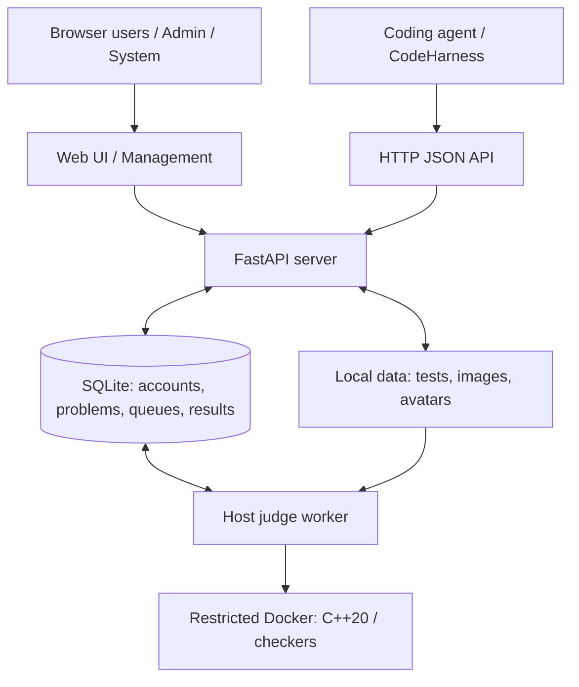

<div align="center">

# MiniOJ

A lightweight online judge for humans and coding agents.

<p>
Solve problems, submit C++20 code and run contests through a web interface or a structured HTTP API.
</p>

<p>
  <a href="#quick-start">
    
  </a>&nbsp;
  <a href="#api">
    
  </a>
</p>

[](pyproject.toml)
[](src/minioj/server/main.py)
[](templates)
[](docker/cpp20/Dockerfile)
[](https://github.com/Sy-SU/MiniOJ/actions/workflows/ci.yml)
[](LICENSE)

[English](README.md) | [简体中文](README_zh.md)

</div>

## Overview

MiniOJ is a self-hosted online judge for Ubuntu and WSL Ubuntu. Browser users can practice, enter contests and review submissions; coding agents and LLM-based clients can retrieve problems, submit solutions and consume judge results over HTTP.

The application combines a FastAPI server, a server-rendered Web UI, SQLite storage and an independent Docker judge worker. CodeHarness is a separate client project: it integrates through the API, and MiniOJ runs independently of it.

For release status and validation evidence, see the [release record](docs/phase5-validation.md).

## Features

- Problem browsing with search, difficulty sorting and pagination; Markdown statements with locally bundled KaTeX.
- C++20 practice with separate Run Sample, Custom Test and Submit actions.
- Structured verdicts, compiler diagnostics, per-test CPU time and memory, submission history and automatically updating result pages.
- Public profiles with solved-problem statistics, recent submissions and local avatar uploads.
- Public contests with configurable problem lists, ICPC standings and difficulty-based single-contest Performance.
- User, Admin and System roles, with a dedicated management console.
- Problem and testcase management, Polygon ZIP import, C++ testlib checkers, standard solutions, generators and single-submission rejudge.
- Bearer-token HTTP JSON API with sanitized problem data, structured feedback and optional submission idempotency.

## Architecture



The server queues submissions, Custom Runs and testcase builds in SQLite. One host worker claims jobs, compiles and executes code in restricted Docker containers, and writes results back. Custom Run returns its result in the same HTTP request; formal submissions are judged asynchronously.

The Web UI uses Jinja2 templates, CSS and small JavaScript modules. There is no separate frontend build. See [architecture and data flow](docs/architecture.md) for details.

## Quick Start

The recommended layout is **Docker Compose for Web/Nginx, plus a worker on the Ubuntu/WSL host**. Compose does not start the judge worker.

### Requirements

- Ubuntu or WSL Ubuntu with Conda/Miniconda; the supplied environment uses Python 3.12.
- Docker Engine or Docker Desktop with WSL integration, Docker Compose v2 and cgroup v2.
- Docker access for the Linux user running the worker. Its job paths must be visible to the Docker daemon.

These steps are for a new installation. For an existing database, use [the upgrade procedure](#upgrading-an-existing-installation).

### 1. Install and configure

```bash
git clone https://github.com/Sy-SU/MiniOJ.git
cd MiniOJ
conda env create --file environment.yml
conda activate minioj
cp .env.example .env
```

Edit `.env`. Replace `MINIOJ_SECRET_KEY` with a persistent random value of at least 32 characters. Generate one to paste into the file:

```bash
python -c 'import secrets; print(secrets.token_urlsafe(48))'
```

Keep `MINIOJ_HTTP_BIND=127.0.0.1` for local access. Set `MINIOJ_HTTP_PORT` if port 80 is unavailable.

Run host commands from the repository root. MiniOJ reads process environment variables, so load `.env` in each host terminal:

```bash
set -a
. ./.env
set +a
```

Compose reads `.env` separately and passes the settings mapped in [compose.yaml](compose.yaml) to the server.

### 2. Build the judge and start the website

```bash
docker build -t minioj-cpp20:latest docker/cpp20
minioj init-db
export MINIOJ_UID="$(id -u)"
export MINIOJ_GID="$(id -g)"
docker compose up -d --build --wait
docker compose exec server minioj create-admin --username admin
```

`init-db` creates the database and data directories and applies idempotent schema upgrades. The account command prompts for email and a password of at least 10 characters; despite its compatible name, `create-admin` creates a **System** account. Use it to sign in and assign content Admin roles through the management console.

The UID/GID settings let the container write host-owned files. If either differs from 1000, save both values in `.env` for subsequent Compose commands.

### 3. Start the worker

In a second terminal, enter the same repository and run:

```bash
conda activate minioj
set -a
. ./.env
set +a
minioj-worker
```

Keep it running for submissions, samples, Custom Tests and testcase builds. `Worker ready` indicates startup is complete. Run one worker per installation; the job-directory lock enforces exclusivity.

Open:

- Web UI: <http://127.0.0.1/minioj/>
- Interactive API docs: <http://127.0.0.1/minioj/docs>
- OpenAPI JSON: <http://127.0.0.1/minioj/openapi.json>

If you changed the HTTP port, include it in these URLs. Sign in as the System account to add problems; participants can register their own accounts.

## Problems and Submissions

Browse **Problems**, search by ID/title, or sort by difficulty. The list shows 50 problems per page. Statements include input/output specifications, limits, public samples and math rendering.

On a problem page, write C++20 and choose **Run Sample**, **Custom Test** or **Submit**. Sample/custom execution does not create a formal submission. Submit queues a judge job and opens its result page, which updates automatically.

Submission details show the verdict, compiler feedback, source with highlighting/copy, and per-test results. Current runs measure process-tree CPU time; unexecuted tests remain marked **Not run**. Preview availability follows the server's feedback mode and account role.

To add a first problem:

1. Open **管理 → Problems → New problem** and enter its statement and limits.
2. Paste or upload a C++20 standard solution and save it.
3. Upload inputs as sample/hidden tests, or use a C++20 generator. The worker computes expected outputs from the standard solution.
4. Once the builds finish, open the problem and submit a solution.

A fresh installation contains no seeded problems. For automated clients, see the [problem, submission and feedback contract](docs/codeharness-api.md).

## Contests

Create public contests from existing problems, arrange their A/B/C order, and set start/end times in UTC. Participants can join from the contest page or through their first contest submission; contest submissions are accepted during the running window.

Standings use **solved descending, penalty ascending**. The first current AC solves a problem; preceding penalized attempts add 20 minutes each. Equal solved/penalty results share rank.

The **Performance** column estimates a contestant's result from solved problems and problem difficulty using a weighted logistic/Elo-like model. It is a single-contest display score, not official Codeforces rating or a permanent user rating, and it does not affect ranking.

Admin/System users can add, remove or reorder contest problems even after the contest starts or ends. Submission and judge history are preserved, and standings recalculate from the current problem list and results, including rejudges. Contests reuse public practice problems rather than a private problem bank.

See [contest rules, scoring and Performance](docs/contest.md). The API exposes contest submissions and JSON standings.

## Users and Roles

Accounts have public profiles with avatars, solved-problem lists, AC statistics and recent submission metadata. **Settings** provides email/password changes, avatar uploads and API-token management.

| Role | Main capabilities |
| --- | --- |
| User (`user`) | Solve problems, submit code, enter contests and manage their own profile/tokens. |
| Admin (`admin`) | User capabilities plus problem/testcase management, all-submission inspection, rejudge and contest management. |
| System (`system`) | Admin capabilities plus user-role/account management and system-status access. |

Public registration creates User accounts. System users assign roles in **管理 → Users**. The System page displays status; deployment configuration is managed through environment variables.

See the [permissions guide](docs/permissions.md) for the detailed matrix.

## Admin

The **管理** entry opens the management console at `/manage` (under `/minioj` in Compose).

- Create, edit and soft-delete problems; manage standard solutions, generators and testcases.
- Import complete Polygon ZIP packages, including statements, images, samples and supported C++ checker sources.
- Filter submissions and rejudge a finished submission while preserving its ID, source, original time and previous runs in **Judge History**.
- Create/edit contests and change their problem lists.
- Manage users and inspect system status with a System account.

Profiles and standings use current results and reflect rejudges. See [rejudge and history](docs/rejudge.md) and [Polygon import support](docs/architecture.md#51-polygon-管理导入扩展2026-10-01).

## API

MiniOJ provides both a human-facing Web UI and a machine-facing versioned HTTP JSON API. Create a token in **Settings → API tokens**, save the one-time displayed secret, and send `Authorization: Bearer <token>`.

Interactive docs are served at `<base-url>/docs`, with the complete OpenAPI specification at `<base-url>/openapi.json`. For the default Compose setup, use [Swagger UI](http://127.0.0.1/minioj/docs) or [OpenAPI JSON](http://127.0.0.1/minioj/openapi.json). The [HTTP v1 contract](docs/codeharness-api.md) describes schemas, feedback, errors and retry behavior.

All paths below are relative to the installation base URL, such as `http://127.0.0.1/minioj`.

| Category | Core endpoints |
| --- | --- |
| Identity and tokens | `GET /api/v1/me`; `GET/POST /api/v1/tokens`; `DELETE /api/v1/tokens/{token_id}` |
| Registration | `POST /api/v1/auth/register` |
| Problem discovery | `GET /api/v1/problems?page=1`; `GET /api/v1/problems/{problem_id}` |
| Agent problem input | `GET /api/v1/agent/problems/{problem_id}` |
| Sample/custom execution | `POST /api/v1/runs` |
| Practice submissions | `POST /api/v1/submissions`; `GET /api/v1/submissions/{submission_id}` |
| Structured feedback | `GET /api/v1/agent/submissions/{submission_id}/feedback` |
| Contest submissions | `POST /api/v1/contests/{contest_id}/submissions` |
| Standings | `GET /api/v1/contests/{contest_id}/standings` |

For example, check identity and submit a solution:

```bash
export OJ_BASE_URL='http://127.0.0.1/minioj'
export OJ_API_TOKEN='oj_replace_with_your_token'

curl -H "Authorization: Bearer $OJ_API_TOKEN" "$OJ_BASE_URL/api/v1/me"

curl -X POST "$OJ_BASE_URL/api/v1/submissions" \
  -H "Authorization: Bearer $OJ_API_TOKEN" \
  -H 'Content-Type: application/json' \
  -H 'Idempotency-Key: sum-two-attempt-001' \
  -d '{"problem_id":"sum-two","language":"cpp20","source_code":"#include <iostream>\nint main(){long long a,b;if(std::cin>>a>>b)std::cout<<a+b<<std::endl;}"}'
```

The example assumes an existing `sum-two` problem whose tests require adding two integers. Replace the ID/source for your own problem. A successful POST returns HTTP 202 and `submission_id`; poll the submission endpoint until `status=FINISHED`, then read structured feedback.

Use `status` and `verdict` rather than parsing human-readable text. For ordinary submission retries, reuse the same `Idempotency-Key` and unchanged payload.

`MINIOJ_FEEDBACK_POLICY` selects `full`, `diagnostic` or `verdict_only`; `GET /api/v1/me` reports the loaded mode. Web and API use the same policy, with hidden testcase previews restricted by role even in `full`.

## CodeHarness Integration

CodeHarness connects to MiniOJ through HTTP, Bearer authentication and JSON:

```text
CodeHarness → Problem → Submission → Poll → Feedback
                └──────── MiniOJ HTTP API ────────┘
```

It can fetch sanitized problem statements and samples, submit C++20 solutions and retrieve structured judge feedback for its own coding/evaluation workflow. MiniOJ contains no CodeHarness agent loop or model-provider configuration.

The standalone [reference client](scripts/smoke_test_codeharness_api.py) demonstrates the full flow using only Python's standard library:

```bash
export OJ_PROBLEM_ID='sum-two'
python scripts/smoke_test_codeharness_api.py --timeout 120 --expect-verdict AC
```

Use the `OJ_BASE_URL` and `OJ_API_TOKEN` set above. This creates a submission; the default source solves the same two-integer sum example. Set `OJ_SOURCE_CODE` for other problems. The client uses finite polling and same-key POST retries; see the [integration contract](docs/codeharness-api.md).

## Import Utilities

Polygon ZIP import is part of the management UI. It accepts complete problem packages with generated inputs/answers and supports standard testlib and custom C++ checkers for non-interactive, non-scoring problems.

The optional [Codeforces import utility](store/cf_import/README.md) is isolated maintenance tooling for importing selected locally solved problems. It has its own configuration, cached/generated artifacts and validation workflow; neither MiniOJ Core nor CodeHarness integration depends on it. Follow its documented reference-selection and request-pacing rules.

## Deployment

Compose publishes only Nginx and serves MiniOJ under `/minioj/`; the FastAPI container has no Docker socket. The host worker uses the same release, SQLite database and problem data as the server.

For remote access, configure `MINIOJ_HTTP_BIND` explicitly. Use an HTTPS reverse proxy and `MINIOJ_SESSION_HTTPS_ONLY=true` for production browser sessions. Persistent worker operation can use the supplied [systemd user service](deploy/minioj-worker.service); adapt its repository/Conda paths before installing it.

Image builds require working access to container registries and package indexes. For proxy-based WSL rebuilds, the [restart helper](restart) supports `MINIOJ_RESTART_PROXY` and a dedicated BuildKit builder.

### Persistent data

- `database/`: SQLite accounts, problems, submissions, contest state and judge history.
- `data/problems/`: testcase files and statement assets.
- `data/avatars/`: uploaded avatars.
- `MINIOJ_JOB_DIR` (default `data/jobs/`): temporary compiler/runtime jobs.

If using `MINIOJ_DATABASE_DIR` or `MINIOJ_DATA_HOST_DIR` mount overrides, align the host worker's `MINIOJ_DATABASE_URL` and `MINIOJ_DATA_DIR` with them. Keep one server process and one worker for the supported V1 layout.

Runtime data and secrets should not be committed to the repository.

### Upgrading an existing installation

Stop all Web, worker and import/CLI writers before backing up the complete SQLite directory (including WAL/SHM files), all persistent data and private configuration. Update both server and host-worker code/dependencies, run `minioj init-db`, then start matching server/judge images and the worker.

The [backup/restore utility](scripts/backup_restore.py) creates verified snapshots and restores into a new directory. See [backup and restore instructions](README_zh.md#一致性备份与隔离恢复), [operating configuration](docs/architecture.md#10-配置日志与运维) and [release validation](docs/phase5-validation.md) for coordinated upgrades and rollback details.

## Project Structure

```text
src/minioj/
├── server/           Web, HTTP API and management routes
├── worker/           Queue processing and result persistence
├── judge/            Docker execution, checkers and resource accounting
└── *.py              Models, database and application services
templates/            Jinja2 Web and management pages
static/               CSS, JavaScript and bundled KaTeX
docker/cpp20/         Judge image and CPU supervisor
deploy/               Nginx configuration and worker service
scripts/              Reference client, backup/restore and smoke checks
store/cf_import/      Optional isolated import tooling
docs/                 Architecture, API contract and operating rules
tests/                Application, migration and browser tests
compose.yaml          Web/Nginx deployment
```

## Development

The Conda environment installs the editable package and development dependencies. For an existing environment, synchronize them with `conda env update --file environment.yml --prune`.

For a host-run Web server instead of Compose, load `.env` as in Quick Start and run:

```bash
uvicorn minioj.server.main:app --host 127.0.0.1 --port 8000 --reload
```

With `MINIOJ_ROOT_PATH=`, open <http://127.0.0.1:8000> and <http://127.0.0.1:8000/docs>. Use the same host worker for judging.

Run the Docker-free application and browser suite:

```bash
python -m playwright install --with-deps chromium
python -m ruff format --check .
python -m ruff check .
python -m pytest -ra
```

[GitHub Actions](.github/workflows/ci.yml) also checks application JavaScript and the example Compose configuration. With Docker and the judge image available, use the isolated integration checks:

```bash
python scripts/smoke_test_stack.py
python scripts/smoke_test_judge.py
python scripts/smoke_test_phase5.py --all-verdicts
```

For Nginx/browser deployment, sandbox, checker, generator, timing and management scenarios, see the remaining `scripts/smoke_test_*.py` tools and their validation scope in [the validation record](docs/phase5-validation.md).

## License

MiniOJ is licensed under the [MIT License](LICENSE). Bundled [testlib](src/minioj/vendor/testlib/LICENSE) and [KaTeX](static/vendor/katex/LICENSE) retain their upstream licenses.
