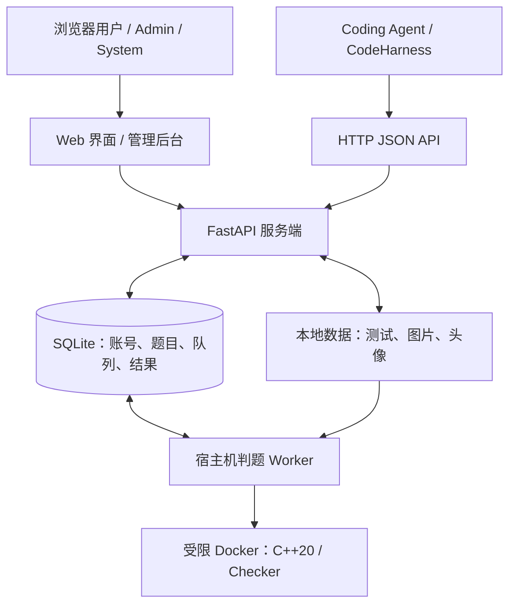

<div align="center">

# MiniOJ

面向用户与 Coding Agent 的轻量 Online Judge。

<p>
通过网页界面或结构化 HTTP API 浏览题目、提交 C++20 代码、参加与管理比赛。
</p>

<p>
  <a href="#快速开始">
    
  </a>&nbsp;
  <a href="#api">
    
  </a>
</p>

[](pyproject.toml)
[](src/minioj/server/main.py)
[](templates)
[](docker/cpp20/Dockerfile)
[](https://github.com/Sy-SU/MiniOJ/actions/workflows/ci.yml)
[](LICENSE)

[English](README.md) | [简体中文](README_zh.md)

</div>

## 概述

MiniOJ 是一个可独立部署在 Ubuntu / WSL Ubuntu 上的轻量 Online Judge。用户可以在浏览器中练习、参加比赛和查看提交；Coding Agent 与基于 LLM 的客户端可以通过 HTTP 获取题目、提交代码和读取评测结果。

系统由 FastAPI 服务端、服务端渲染的 Web UI、SQLite 存储和独立的 Docker 判题 Worker 组成。CodeHarness 是独立的客户端项目，通过 API 接入；MiniOJ 不依赖 CodeHarness 即可运行。

发布状态与验收证据见[发布记录](docs/phase5-validation.md)。

## 功能

- 题库浏览、搜索、难度排序与分页；Markdown 题面和本地 KaTeX 数学公式渲染。
- C++20 练习，分别提供 Run Sample、Custom Test 和 Submit。
- 结构化 verdict、编译诊断、逐测试点 CPU 时间与内存、提交历史和自动更新的结果页。
- 公开个人主页、已解决题目统计、最近提交和本地头像上传。
- 公开比赛、可调整的题目列表、ICPC 排名和基于难度的单场 Performance。
- User、Admin、System 三种角色与独立管理后台。
- 题目与测试数据管理、Polygon ZIP 导入、C++ testlib Checker、标准解、生成器和单次提交重判。
- Bearer Token HTTP JSON API，提供清洗题目、结构化反馈和可选的普通提交幂等键。

## 架构



服务端将 Submission、Custom Run 和测试数据构建任务写入 SQLite 队列。一个宿主机 Worker 领取任务，在受限 Docker 容器中编译、运行代码并写回结果。Custom Run 在同一次 HTTP 请求中返回结果；正式提交异步评测。

Web UI 使用 Jinja2 模板、CSS 和轻量 JavaScript 模块，无需单独构建前端。详细设计见[架构与数据流](docs/architecture.md)。

## 快速开始

推荐部署方式为 **Docker Compose 运行 Web/Nginx，Ubuntu/WSL 宿主机运行 Worker**。Compose 不会启动判题 Worker。

### 环境要求

- Ubuntu / WSL Ubuntu，安装 Conda/Miniconda；仓库提供的环境使用 Python 3.12。
- Docker Engine，或启用了 WSL 集成的 Docker Desktop；Docker Compose v2 和 cgroup v2。
- 运行 Worker 的 Linux 用户具有 Docker 访问权限，且 Docker Daemon 能访问其 Job 目录。

以下步骤适用于新安装。已有数据库请先阅读[升级已有安装](#升级已有安装)。

### 1. 安装与配置

```bash
git clone https://github.com/Sy-SU/MiniOJ.git
cd MiniOJ
conda env create --file environment.yml
conda activate minioj
cp .env.example .env
```

编辑 `.env`，将 `MINIOJ_SECRET_KEY` 替换为至少 32 个字符的持久随机值。可生成后粘贴到文件中：

```bash
python -c 'import secrets; print(secrets.token_urlsafe(48))'
```

本机访问时保留 `MINIOJ_HTTP_BIND=127.0.0.1`；若端口 80 不可用，修改 `MINIOJ_HTTP_PORT`。

宿主机命令均在仓库根目录执行。MiniOJ 读取进程环境变量，因此每个宿主机终端都需要加载 `.env`：

```bash
set -a
. ./.env
set +a
```

Compose 单独读取 `.env`，并将 [compose.yaml](compose.yaml) 中显式映射的配置传给 Server。

### 2. 构建判题镜像并启动网站

```bash
docker build -t minioj-cpp20:latest docker/cpp20
minioj init-db
export MINIOJ_UID="$(id -u)"
export MINIOJ_GID="$(id -g)"
docker compose up -d --build --wait
docker compose exec server minioj create-admin --username admin
```

`init-db` 创建数据库和数据目录，并执行幂等 schema 升级。账号命令会提示输入邮箱和至少 10 位的密码；`create-admin` 保留了兼容命令名，实际创建的是 **System** 账号。用该账号登录后，可在管理后台分配内容管理用的 Admin 角色。

UID/GID 配置让容器能够写入宿主机用户拥有的文件。若任一值不是 1000，请将两个实际值都保存到 `.env`，供后续 Compose 命令使用。

### 3. 启动 Worker

在第二个终端进入同一仓库，执行：

```bash
conda activate minioj
set -a
. ./.env
set +a
minioj-worker
```

保持 Worker 运行，以处理提交、样例、自定义测试和测试数据构建。`Worker ready` 表示启动完成。每个实例运行一个 Worker，Job 目录独占锁会阻止重复启动。

打开：

- Web UI：<http://127.0.0.1/minioj/>
- 交互式 API 文档：<http://127.0.0.1/minioj/docs>
- OpenAPI JSON：<http://127.0.0.1/minioj/openapi.json>

若修改了 HTTP 端口，请在 URL 中加入对应端口。用 System 账号登录并添加题目；参赛者可以自行注册账号。

## 题目与提交

在 **Problems** 中按题号或标题搜索、按难度排序，每页显示 50 道题。题面包含输入输出说明、资源限制、公开样例和数学公式。

在题目页编写 C++20 代码，选择 **Run Sample**、**Custom Test** 或 **Submit**。样例与自定义测试不会创建正式提交；Submit 将任务入队并打开自动更新的结果页。

提交详情显示 verdict、编译反馈、源码高亮与复制，以及逐测试点结果。当前评测记录进程树 CPU 时间，未执行的测试点标记为 **Not run**。数据预览遵循服务端反馈模式与账号角色。

添加第一道题：

1. 打开 **管理 → Problems → New problem**，填写题面和资源限制。
2. 粘贴或上传 C++20 标准解并保存。
3. 上传 sample/hidden 输入文件，或使用 C++20 生成器；Worker 运行标准解计算期望输出。
4. 构建完成后，打开题目并提交代码。

新安装不预置题目。自动化客户端请参阅[题目、提交与反馈契约](docs/codeharness-api.md)。

## 比赛

从已有题目创建公开比赛，调整 A/B/C 题序，并按 UTC 设置起止时间。用户可在比赛页报名，也可通过首次比赛提交自动报名；比赛提交仅在比赛进行期间接收。

榜单按 **solved 降序、penalty 升序** 排名。当前首次 AC 计为解题，此前应计罚时的失败提交每次增加 20 分钟；解题数与罚时均相同的用户共享名次。

**Performance** 使用难度加权的 logistic/Elo-like 模型，根据解题情况与题目难度估计单场表现。它不是官方 Codeforces rating，也不保存为用户永久 rating，且不影响排名。

Admin/System 在比赛开始或结束后仍可增删、重排题目。提交与评测历史保留，榜单根据当前题目列表及当前结果动态重算，重判也会反映到榜单中。比赛复用公开练习题库，不提供私密题库语义。

详细规则见[比赛、计分与 Performance](docs/contest.md)。API 提供比赛提交和 JSON 榜单。

## 用户与角色

账号拥有公开主页，展示头像、已解决题目、AC 统计和最近提交 metadata。**Settings** 提供邮箱与密码修改、头像上传和 API Token 管理。

| 角色 | 主要能力 |
| --- | --- |
| User（`user`） | 练习、提交、参加比赛，管理自己的个人资料与 Token。 |
| Admin（`admin`） | User 能力，以及题目与测试数据管理、全部提交查看、重判和比赛管理。 |
| System（`system`） | Admin 能力，以及用户角色与账号管理、系统状态查看。 |

公开注册创建 User 账号。System 在 **管理 → Users** 中分配角色。System 页面只展示状态；部署配置通过环境变量管理。

完整权限矩阵见[权限指南](docs/permissions.md)。

## 管理后台

**管理** 入口打开 `/manage` 管理后台；Compose 部署时位于 `/minioj` 前缀下。

- 创建、编辑和软删除题目，管理标准解、生成器与测试数据。
- 导入完整 Polygon ZIP 包，包含题面、图片、样例和支持的 C++ Checker 源码。
- 筛选提交并重判已完成的提交，保留 ID、源码、原始时间与 **Judge History** 中的历次结果。
- 创建、编辑比赛，调整比赛题目列表。
- 使用 System 账号管理用户与查看系统状态。

个人统计与榜单使用当前结果，随重判更新。详见[重判与历史](docs/rejudge.md)及 [Polygon 导入支持](docs/architecture.md#51-polygon-管理导入扩展2026-10-01)。

## API

MiniOJ 同时提供面向用户的 Web UI 和面向程序的版本化 HTTP JSON API。在 **Settings → API tokens** 创建 Token，保存仅展示一次的密钥，请求时携带 `Authorization: Bearer <token>`。

交互式文档位于 `<base-url>/docs`，完整 OpenAPI 规范位于 `<base-url>/openapi.json`。默认 Compose 部署可打开 [Swagger UI](http://127.0.0.1/minioj/docs) 或 [OpenAPI JSON](http://127.0.0.1/minioj/openapi.json)。[HTTP v1 契约](docs/codeharness-api.md)说明 schema、反馈、错误与重试行为。

下列路径均相对于实例的基础 URL，例如 `http://127.0.0.1/minioj`。

| 类别 | 核心接口 |
| --- | --- |
| 身份与 Token | `GET /api/v1/me`；`GET/POST /api/v1/tokens`；`DELETE /api/v1/tokens/{token_id}` |
| 注册 | `POST /api/v1/auth/register` |
| 题目发现 | `GET /api/v1/problems?page=1`；`GET /api/v1/problems/{problem_id}` |
| Agent 题目输入 | `GET /api/v1/agent/problems/{problem_id}` |
| 样例与自定义运行 | `POST /api/v1/runs` |
| 练习提交 | `POST /api/v1/submissions`；`GET /api/v1/submissions/{submission_id}` |
| 结构化反馈 | `GET /api/v1/agent/submissions/{submission_id}/feedback` |
| 比赛提交 | `POST /api/v1/contests/{contest_id}/submissions` |
| 榜单 | `GET /api/v1/contests/{contest_id}/standings` |

例如，查询身份并提交代码：

```bash
export OJ_BASE_URL='http://127.0.0.1/minioj'
export OJ_API_TOKEN='oj_replace_with_your_token'

curl -H "Authorization: Bearer $OJ_API_TOKEN" "$OJ_BASE_URL/api/v1/me"

curl -X POST "$OJ_BASE_URL/api/v1/submissions" \
  -H "Authorization: Bearer $OJ_API_TOKEN" \
  -H 'Content-Type: application/json' \
  -H 'Idempotency-Key: sum-two-attempt-001' \
  -d '{"problem_id":"sum-two","language":"cpp20","source_code":"#include <iostream>\nint main(){long long a,b;if(std::cin>>a>>b)std::cout<<a+b<<std::endl;}"}'
```

示例假设已有 `sum-two` 题目，要求对输入的两个整数求和。请按自己的题目替换题号与源码。POST 成功返回 HTTP 202 和 `submission_id`；轮询提交接口直到 `status=FINISHED`，再读取结构化反馈。

客户端应使用 `status` 和 `verdict`，不要解析面向用户的说明文字。重试普通提交时，复用同一个 `Idempotency-Key` 和未改动的请求体。

`MINIOJ_FEEDBACK_POLICY` 可设为 `full`、`diagnostic` 或 `verdict_only`，`GET /api/v1/me` 告知当前加载的模式。Web 与 API 使用同一策略；即使在 `full` 下，隐藏测试点预览仍受角色权限限制。

## CodeHarness 接入

CodeHarness 通过 HTTP、Bearer 认证和 JSON 连接 MiniOJ：

```text
CodeHarness → Problem → Submission → Poll → Feedback
                └──────── MiniOJ HTTP API ────────┘
```

它可以获取清洗后的题面与样例、提交 C++20 代码，并读取结构化评测反馈，供自身编程与评测流程使用。MiniOJ 不包含 CodeHarness 的 Agent Loop 或模型 Provider 配置。

独立的[参考客户端](scripts/smoke_test_codeharness_api.py)仅使用 Python 标准库，展示完整流程：

```bash
export OJ_PROBLEM_ID='sum-two'
python scripts/smoke_test_codeharness_api.py --timeout 120 --expect-verdict AC
```

使用上文设置的 `OJ_BASE_URL` 与 `OJ_API_TOKEN`。该命令会创建真实提交，默认源码解决同一个两整数求和示例；其他题目请设置 `OJ_SOURCE_CODE`。客户端使用有限轮询与同 key POST 重试，详见[接入契约](docs/codeharness-api.md)。

## 导入工具

Polygon ZIP 导入是管理界面的内置功能，接收包含已生成输入与答案的完整题目包，支持非交互、非评分题目的标准 testlib 和自定义 C++ Checker。

可选的 [Codeforces 导题工具](store/cf_import/README.md)是独立维护工具，用于导入选定的本地已解题目。它使用自己的配置、缓存与生成产物，以及验证流程；MiniOJ Core 和 CodeHarness 接入均不依赖它。使用时请遵循工具文档中的参考程序选择与请求节奏规则。

## 部署

Compose 只发布 Nginx 端口，在 `/minioj/` 下提供服务；FastAPI 容器不挂载 Docker Socket。宿主机 Worker 与 Server 使用同一版本、同一个 SQLite 数据库和同一份题目数据。

远程访问需显式配置 `MINIOJ_HTTP_BIND`。生产浏览器访问应使用 HTTPS 反向代理，并设置 `MINIOJ_SESSION_HTTPS_ONLY=true`。常驻 Worker 可使用仓库提供的 [systemd 用户服务](deploy/minioj-worker.service)，安装前按实际位置调整仓库与 Conda 路径。

镜像构建需要能够访问容器 Registry 与包索引。WSL 代理环境下的重建可使用 [restart 脚本](restart)，它支持 `MINIOJ_RESTART_PROXY` 和专用 BuildKit 构建器。

### 持久化数据

- `database/`：SQLite 账号、题目、提交、比赛状态与评测历史。
- `data/problems/`：测试数据文件与题面资源。
- `data/avatars/`：上传的头像。
- `MINIOJ_JOB_DIR`（默认 `data/jobs/`）：临时编译与运行任务目录。

若通过 `MINIOJ_DATABASE_DIR` 或 `MINIOJ_DATA_HOST_DIR` 覆盖挂载目录，应同步宿主机 Worker 的 `MINIOJ_DATABASE_URL` 与 `MINIOJ_DATA_DIR`。V1 支持的部署方式使用一个 Server 进程和一个 Worker。

运行数据和密钥不应提交到仓库。

<a id="已有安装升级三角色比赛与重判"></a>

### 升级已有安装

先停止所有 Web、Worker 和导题／CLI 写入方，再备份完整 SQLite 目录（包括 WAL/SHM）、全部持久化数据及私密配置。同步 Server 与宿主机 Worker 的代码和依赖，执行 `minioj init-db`，再启动匹配的 Server/Judge 镜像及 Worker。

[备份恢复工具](scripts/backup_restore.py)创建经过校验的快照，并只恢复到新目录。具体操作见[一致性备份与隔离恢复](#一致性备份与隔离恢复)、[运行配置](docs/architecture.md#10-配置日志与运维)及[发布验收记录](docs/phase5-validation.md)。

### 一致性备份与隔离恢复

备份前停止所有写入方，包括 Web、Worker、导题程序和 CLI；认证 GET 也可能更新 Token 使用时间。使用 systemd 用户服务时停止 `minioj-worker` 服务，否则停止前台 Worker；Compose 部署停止 `nginx` 和 `server`。备份期间保持所有写入方停止。

源目录必须对应实际配置与挂载。选择仓库外、私密且尚不存在的目标路径，保存整个 SQLite 目录（含 WAL/SHM/journal）与全部 data：

```bash
python scripts/backup_restore.py backup --writers-stopped \
  --database-dir ./database --data-dir ./data \
  --destination /absolute/private-backups/snapshot
```

路径是占位示例，请替换为自己的实际目录。`--database-name` 默认为 `oj.db`。工具新建 0700 快照目录，校验文件摘要、SQLite integrity 与外键，检测源变化并拒绝符号链接；`--writers-stopped` 只是操作确认，不会替你停止服务。`.env`、代码版本与镜像记录应另存到私密位置，不公开备份。

恢复到新的隔离目录，不覆盖正式安装：

```bash
python scripts/backup_restore.py restore \
  --snapshot /absolute/private-backups/snapshot \
  --destination /absolute/isolated-restore
```

工具校验 manifest、文件与 SQLite，拒绝已存在的目标目录，即使该目录为空。恢复后使用匹配代码与镜像，将隔离 Server/Worker 指向恢复的数据库和 data，配置独立 Job 目录、唯一 `MINIOJ_WORKER_OWNER` 与回环端口；完成新提交 AC 验证后，再协调正式恢复。

临时 Job 无需作为持久化数据恢复。回滚时应整体匹配代码、配置、数据库与 data；失败时保留新建的不完整目录供检查，不覆盖或删除原数据。

## 项目结构

```text
src/minioj/
├── server/           Web、HTTP API 与管理路由
├── worker/           队列处理与结果持久化
├── judge/            Docker 执行、Checker 与资源计量
└── *.py              模型、数据库与应用服务
templates/            Jinja2 网页与管理页面
static/               CSS、JavaScript 与本地 KaTeX
docker/cpp20/         判题镜像与 CPU supervisor
deploy/               Nginx 配置与 Worker 服务
scripts/              参考客户端、备份恢复与冒烟检查
store/cf_import/      可选的独立导题工具
docs/                 架构、API 契约与运行规则
tests/                应用、迁移与浏览器测试
compose.yaml          Web/Nginx 部署
```

## 开发

Conda 环境会以 editable 模式安装项目及开发依赖。已有环境可通过 `conda env update --file environment.yml --prune` 同步。

如需以宿主机 Web 服务替代 Compose，按快速开始加载 `.env` 后执行：

```bash
uvicorn minioj.server.main:app --host 127.0.0.1 --port 8000 --reload
```

设置 `MINIOJ_ROOT_PATH=` 时，访问 <http://127.0.0.1:8000> 和 <http://127.0.0.1:8000/docs>；判题仍使用同一个宿主机 Worker。

无需 Docker 的应用与浏览器测试：

```bash
python -m playwright install --with-deps chromium
python -m ruff format --check .
python -m ruff check .
python -m pytest -ra
```

[GitHub Actions](.github/workflows/ci.yml)还检查应用 JavaScript 与示例 Compose 配置。Docker 与判题镜像就绪后，可运行隔离的集成检查：

```bash
python scripts/smoke_test_stack.py
python scripts/smoke_test_judge.py
python scripts/smoke_test_phase5.py --all-verdicts
```

Nginx/浏览器部署、Sandbox、Checker、生成器、计时和管理场景，见其余 `scripts/smoke_test_*.py` 工具及[验收记录](docs/phase5-validation.md)中的验证范围。

## 许可证

MiniOJ 使用 [MIT License](LICENSE)。随包提供的 [testlib](src/minioj/vendor/testlib/LICENSE) 与 [KaTeX](static/vendor/katex/LICENSE) 保留各自的上游许可证。
