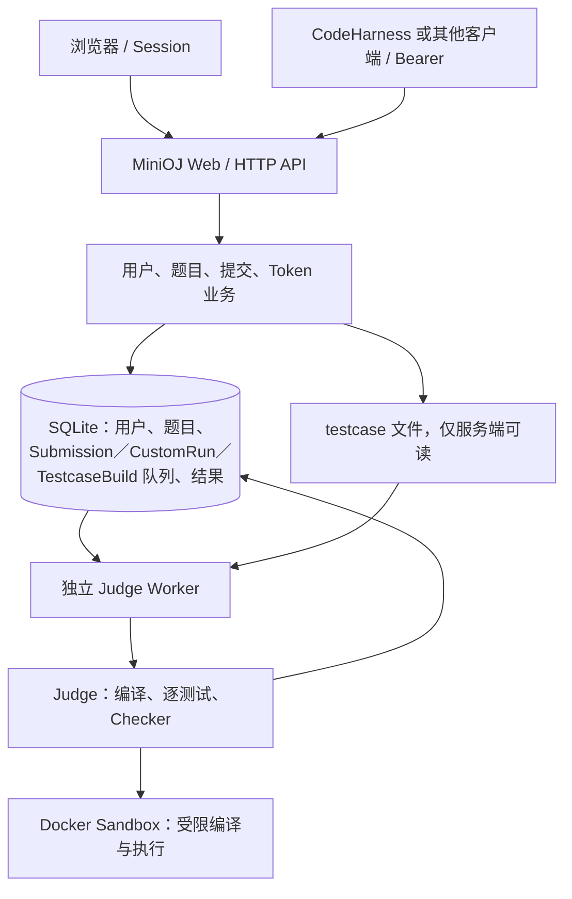

# MiniOJ 架构与接口约定

更新日期：2026-10-02。依据：独立 OJ 规划、新功能附件、网页体验要求及当前实测。实施任务见 [TODO.md](../TODO.md)。

本文区分**规划约束／共用约定**、**当前实现**和**验收证据**。已有代码不等于运行验证；Phase 0–5 的实际范围见第 12 节与 TODO，不外推为正式部署通过。Phase 2–3 已推送为 `8d8cafc`；其后脏工作区原样保留并增量开发，不重建骨架。最新 Phase 5 冻结契约见 [codeharness-api.md](codeharness-api.md)，以下早期记录保留为历史。

当前 Release Candidate 审计只做发布安全、冻结契约、迁移保留和文档复核，不开发新功能；结论 READY_WITH_NOTES，完整 723 项测试及本地 CI 等价检查通过，最新结果见 [TODO](../TODO.md)。Phase 0–5、题库分页／排序已有验收；GitHub 托管 CI 首跑、正式停机升级／部署未执行，本轮不 commit/push。公开 `.env.example` 经批准改为 loopback 绑定，实际 `.env` 和 Compose 旧 fallback 不变。

## 1. 定位与 V1 边界

MiniOJ 是部署在 Ubuntu / WSL Ubuntu 的独立轻量级 Online Judge，既服务浏览器用户，也提供远程 HTTP JSON API。即使没有 CodeHarness，用户也能注册登录、看题、运行样例、自定义测试、提交 C++20、查看结果和管理 Token。

| 项目 | 环境 | 职责和边界 |
| --- | --- | --- |
| MiniOJ | Ubuntu / WSL Ubuntu | Web、用户权限、题目、testcase、提交、独立 Worker、Judge、Docker Sandbox、HTTP API |
| CodeHarness | macOS | 独立远程客户端；经 HTTP、Bearer Token 和 JSON 调用 MiniOJ |

仓库和产品名称只有 MiniOJ，不使用“CodeHarness OJ”。CodeHarness 的 Agent Loop、模型路由、LLM Provider、Prompt、Agent State、Workspace 和实验执行不属于 MiniOJ Core；Core 不需要百炼或其他 LLM API Key。两个项目不相互 import，不共享数据库、题库目录和运行时对象。API 中 /agent/ 仅是程序消费命名空间，不意味着 MiniOJ 内部有 Agent。仓库另有可选 `store/cf_import` 导题工具，独立使用本地模型配置并经管理员 HTTP 调用 Core；它不是 CodeHarness 内部实现，不成为 Core 或 Reference Client 的启动依赖。配置／密钥／缓存／个人题解／生成产物全部保持 Git-ignored。

V1 技术栈为 Python、FastAPI、SQLAlchemy、SQLite、Jinja2、markdown-it-py、mdit-py-plugins、少量 JavaScript、Docker、g++ C++20。题面数学公式由本地托管的 KaTeX 0.18.10 在浏览器渲染，不依赖外部 CDN。现有包要求 Python >=3.11，Conda 和 Web 镜像使用 Python 3.12；采用 Argon2 密码哈希、Pydantic 请求结构、签名 Session。依赖依据 [pyproject.toml](../pyproject.toml)、[environment.yml](../environment.yml) 和 [Dockerfile](../Dockerfile)。

V1 Core 不引入 React、Vue、Redis、RabbitMQ、NATS、Kubernetes；不做多语言、评分／交互题、积分系统、内置 Codeforces 在线抓取或复杂编辑器。按新增需求，已扩展公开 Contest／ICPC 排名及单场 Performance、三角色权限、独立管理后台、单提交重判与历史、个人主页／头像，以及 generator、Polygon ZIP 导入和 C++ testlib Special Judge。独立 CF 工具见 [工具说明](../store/cf_import/README.md)，不得将其本地历史答案修复／生成 evidence 纳入 Core 源码或扩大为整个 CF 题库的算法验收。冻结榜、私密比赛、用户永久 rating、批量重判、Brute／Stress Test、SSE、多 Worker 和外部队列仍待单独规划。

## 2. 模块职责与现有目录

沿用现有 src/minioj 布局，不为匹配推荐目录而搬迁模块或创建空文件。

| 职责 | 当前文件 | 约束与差距 |
| --- | --- | --- |
| HTTP 入口与配置 | [server/main.py](../src/minioj/server/main.py)、[config.py](../src/minioj/config.py)、[middleware.py](../src/minioj/server/middleware.py) | 配置、Session、生命周期和请求限制；不在正式提交请求里判题 |
| Web 与 API | [web.py](../src/minioj/server/web.py)、[api.py](../src/minioj/server/api.py)、[dependencies.py](../src/minioj/server/dependencies.py) | 认证、权限、参数、响应和页面；当前仍包含大量业务和反馈拼装 |
| 业务、模型与数据库 | [accounts.py](../src/minioj/accounts.py)、[problems.py](../src/minioj/problems.py)、[testcase_builds.py](../src/minioj/testcase_builds.py)、[models.py](../src/minioj/models.py)、[database.py](../src/minioj/database.py) | 用户、题目、std／generator／Custom Run 队列、测试文件、提交和 Token |
| 权限／重判／比赛／个人资料 | [permissions.py](../src/minioj/permissions.py)、[submissions.py](../src/minioj/submissions.py)、[contests.py](../src/minioj/contests.py)、[profiles.py](../src/minioj/profiles.py)、[avatars.py](../src/minioj/avatars.py) | 集中能力、共享提交准入、JudgeRun 快照、动态排名与 solved、本地安全头像；不引入第二套 Judge |
| 单场 Performance | [contest_performance.py](../src/minioj/contest_performance.py) | DB 无关纯函数；输入 rating／当前 solved，难度加权 logistic 估计，不参与排序或写 User |
| 新功能 HTTP 适配 | [management.py](../src/minioj/server/management.py)、[contests.py](../src/minioj/server/contests.py)、[profiles.py](../src/minioj/server/profiles.py) | 独立 Console、比赛／个人主页；管理写操作复用服务层和 CSRF |
| 反馈转换 | [feedback.py](../src/minioj/feedback.py) | Web／History／API 共用显式 allowlist、1024 UTF-8 字节截断和诊断清洗，不复制内部 Judge dict |
| 协议结构 | [schemas.py](../src/minioj/schemas.py) | 明确请求／响应、原错误包络及 FeedbackResponse；OpenAPI 契约回归 |
| Worker | [worker/main.py](../src/minioj/worker/main.py) | 独立进程轮询 Submission 与 TestcaseBuild，条件 claim 后调用 Sandbox 并保存结果 |
| Judge / 编译 / Sandbox | [judge/runner.py](../src/minioj/judge/runner.py) | 当前集中在 DockerJudge；逻辑上区分编译、逐测试运行、资源收集和结论生成，Docker 操作保持集中 |
| Checker | [judge/checker.py](../src/minioj/judge/checker.py)、[judge/testlib.py](../src/minioj/judge/testlib.py)、vendor/testlib/ | 兼容旧题纯比较；新 Polygon 题保存 C++ checker 快照，Worker 在独立 Docker 沙箱比较，不处理身份或页面 |
| 浏览器 | templates/、static/ | Jinja2、textarea、简单 JS 和本地 KaTeX 静态资源 |
| 运维与验证 | [CLI](../src/minioj/cli.py)、docker/cpp20/、deploy/、scripts/、tests/ | 初始化、管理员、镜像和测试；存在脚本不代表已通过验收 |

不创建 agent/ 或与 CodeHarness 共用内部实现的 shared/。外部客户端只见 HTTP，不接触 Docker、WSL 命令、数据库和 testcase 路径。

## 3. 部署关系与数据流

下图是正式提交的职责关系；Custom Run 的当前差异在下文说明。



**当前开发方式：** Web 与 Worker 可分别在 Ubuntu/WSL 运行，共用 `Settings` 及 `MINIOJ_*` 命名，并指向同一 SQLite 和 data。应用不会自行解析 .env；宿主进程须由 shell 或环境管理器注入，README 使用 `set -a; . ./.env; set +a`。minioj init-db 建表并幂等升级，Web/Worker 启动也调用初始化；兼容命名的 minioj create-admin 或 `MINIOJ_ADMIN_*` 创建 system 引导账户。既有安装升级应先停止旧 Web 和 Worker，避免角色迁移后旧权限代码仍运行，步骤见 README。

**当前 Compose 方式：** [compose.yaml](../compose.yaml) 只有 Nginx 和 Server，Worker 按 README 在 WSL 宿主启动。Compose 从 .env 读取插值，但只向 Server 注入文件内显式映射的配置；容器内数据库、data 和 job 路径为 /app/database、/app/data、/app/data/jobs，宿主挂载目录可用 `MINIOJ_DATABASE_DIR`／`MINIOJ_DATA_HOST_DIR` 覆盖。Worker 必须在宿主加载相应配置并使用同一份数据库和 testcase 数据；Docker bind mount 必须按 daemon 可见的宿主路径解析。Nginx 使用 /minioj/，保留该前缀以及原始 Host／非标准端口，Server 设置 MINIOJ_ROOT_PATH=/minioj。正式外部地址由部署者配置，不把仓库示例地址推广为其他环境默认值。

**Custom Run 部署链路：** 对外仍是同步 `POST /api/v1/runs`，Server 只写入短生命周期 `CustomRun` 行并等待 Worker 终态；独占 Worker 条件领取后调用 DockerJudge，完成后 Server 返回原有成功结果并删除该行。Server 镜像无需 Docker CLI 或 socket，也没有新增公共轮询接口。等待 Worker 超时会取消尚未领取的任务并返回安全 503；已领取任务由 Worker 收尾，终态遗留行按保留期清理。

**正式提交流程：**

1. Web/API 校验用户、语言、源码大小和题目，写入 QUEUED，返回 HTTP 202 与 submission_id。
2. Worker 选择最早 QUEUED 行，通过带 status=QUEUED 条件的 UPDATE 改为 COMPILING；仅 rowcount=1 的消费者持有该任务。
3. Worker 读取题目限制及 testcase；Judge 在独立容器内编译，失败保存 CE 并直接 FINISHED。
4. 编译成功调用回调将状态置 RUNNING；每个 testcase 新建执行容器，Checker 比较输出。
5. 当前遇首个失败即停止；保存 compile_result、judge_result、verdict、finished_at，并置 FINISHED；客户端查询最终结果。

V1 以数据库 Submission 为队列，不依赖外部消息系统。每个 `MINIOJ_JOB_DIR` 只允许一个 Worker：进程使用非阻塞文件锁防止本机重复启动，数据库条件 UPDATE 防止同一 QUEUED 行重复领取。Worker 启动时把遗留 COMPILING/RUNNING Submission 终结为安全 IE，把 RUNNING TestcaseBuild 终结为 FAILED；不自动重跑，避免不可信代码重复执行。最终结果也以非终态条件 UPDATE 写入，已终态任务不会被重复覆盖。此策略是单机 V1 恢复语义，不表示支持多主机 Worker。

Worker 启动恢复发生在镜像检查前；之后按 `minioj.owner=$MINIOJ_WORKER_OWNER` 标签清理上一进程的容器，并清理 run／judge／testcase-build／checker 临时目录。owner 默认 `worker`，并行隔离实例必须使用不同值，避免跨实例清理。恢复时 RUNNING CustomRun 变为 FAILED，COMPILING/RUNNING Submission 变为 IE，RUNNING TestcaseBuild 变为 FAILED，均不自动重跑。正常清理失败会记录日志并按基础设施错误处理。claim、读取题目和最终落库的异常由循环记录；若处理阶段异常导致任务仍为非终态，独占 Worker 会尝试执行同一终结策略。内部 Docker、文件路径和 traceback 只写服务端日志，对外 IE 使用固定安全说明。

**Testcase 构建流程：** Admin 先为题目上传一份 C++20 std，源码和 SHA-256 只保存在管理侧数据库。上传输入时，Web 把 UTF-8 input 与 std 快照写入 TestcaseBuild；上传 generator 时还保存 generator 源码、case count 与 base seed。Worker 条件领取 QUEUED 任务，在同一受限 Docker 镜像中编译 std；generator 模式再编译一次 generator，并以 `argv[1]=base_seed+offset`、`argv[2]=1-based index` 逐例运行。generator stdout 成为输入，std stdout 成为 expected output。全部运行成功后，一批 Testcase 文件、metadata 和任务 FINISHED 状态在同一数据库提交边界完成；失败标记 FAILED 且不创建部分用例。Web Server 不需要 Docker 通道，共用用户／Agent HTTP 约定没有变化。Worker 异常退出后，遗留 RUNNING 构建在下次启动时置为 FAILED，不自动重跑。

**Custom Run：** 只编译源码并运行调用方 stdin，不查 hidden testcase、不创建正式 Submission，仍使用相同 Sandbox 和限制。Run Sample 从下拉框选择公开样例、把公开 input 交给 Custom Run 并在浏览器比较公开 expected；Custom Test 使用独立输入框，Submit 才创建正式评测。三个操作已有独立按钮。

## 4. 用户、Session、Token 与权限

User 角色为 user/admin/system。`permissions.py` 按明确能力集合判断，不比较角色字符串；system 包含内容管理能力，用户／系统管理仅 system。浏览器使用 Session；程序客户端日常使用 Authorization: Bearer <token>，初始 Token 从 Web Settings 创建。当前普通认证依赖优先处理 Authorization，缺失时读取 Session；/agent/ 两个接口强制 Bearer。普通题目 GET 当前公开可读。Session 表单和 Cookie API 写请求分别检查表单 CSRF 和 X-CSRF-Token；Bearer 请求走独立认证分支。

普通用户可看题、运行、提交、看本人提交、参加比赛、管理本人资料／头像／密码／Token。Admin 和 system 可管理题目、std／generator／testcase、全部提交、重判及比赛；仅 system 可调整用户角色／启停和查看系统页。后端能力检查与导航相互独立；admin 直接访问用户／系统管理返回 403，提交和 Token 越权查询为 404。禁止 system 自降级／禁用及移除最后一个活跃 system。std、generator 源码和构建诊断不进入公开／Agent 题目响应。完整矩阵及迁移约束见 [permissions.md](permissions.md)。

`roles-v2` 标记在一次事务中将所有旧 admin 迁移为 system；重复启动不会提升之后创建的内容管理员。命令／环境变量名称保持兼容，但 bootstrap 校验的是匹配且活跃的 system；不自动提升有冲突的普通账号。系统页只读展示安全状态，不提供在线环境配置写入口或泄漏路径／secret。

密码使用 Argon2，数据库不存明文。账号 POST 固定限制为 16 KiB；源码、stdin 和 API testcase JSON 依据配置上限，在 JSON 解析前同时检查 Content-Length 和实际分块字节。Web std／generator／testcase 上传在 multipart／表单解析流中限制总请求体，并继续执行单文件及解析后 UTF-8 字节校验。Session 由 Starlette SessionMiddleware 签名，属于客户端 Cookie 会话，不能当作加密保密存储。

Token 当前以 oj_ 开头，随机生成，存 SHA-256 hash 和不可恢复完整密钥的掩码 preview；原文仅创建时显示。规划中的 minioj_ 是前缀示例，本轮不改现有前缀。支持 expires_at、revoked_at 检查和 last_used_at 更新。

当前 Web 通过 Session 中的 revealed_token 中转一次展示原文；数据库不存 Token 原文。D10 固定为软撤销：`DELETE /api/v1/tokens/{id}` 保持 204，设置 `revoked_at` 并保留 metadata 与 hash，重复撤销对仍有权限的 Session／Bearer 调用幂等；被撤销密钥立即返回 401。Web 保留原 `/delete` 路径以兼容表单，但 UI 和提示统一使用 Revoke；不提供公开硬删除。普通日志不得记录密码、Token 原文、源码或 SECRET_KEY。

## 5. 数据模型与存储

字段依据 [models.py](../src/minioj/models.py)。表内“差距”是后续任务，不代表本轮已迁移数据库。

| 实体 | 当前主要字段 | 规划映射／差距 |
| --- | --- | --- |
| User | id, username, email, password_hash, role, is_active, avatar_key, created_at, updated_at | lower(username) 唯一索引；avatar_key 为随机 PNG key，不保存客户端路径 |
| ApiToken | id, user_id, name, token_hash, token_preview, created_at, last_used_at, expires_at, revoked_at | preview 为现有扩展；DELETE 软撤销并保留 metadata，不提供公开硬删除 |
| Problem | id, revision, deleted_at, title, statement, limits, checker, checker_name, checker_bundle, checker_sha256, source metadata, rating, tags, standard_source, standard_sha256, standard_updated_at, created_by, timestamps | checker 默认 lines，旧库幂等补列；testlib 源码快照仅内部保存；std 仅 Admin 使用；revision 递增，deleted_at 软删除 |
| TestCase | id, problem_id, type, order, input_path, output_path, input_sha256, output_sha256, created_at | order 对应规划 index，每题唯一；旧库升级时补 created_at，旧文件的 checksum 可暂为空 |
| Sample | id, problem_id, testcase_id, input, output, order | 当前额外表，保存公开样例；新数据以可空且唯一的 testcase_id 精确同步，兼容没有关联的旧 Sample |
| TestcaseBuild | id, problem_id, created_by, kind, testcase_type, std 快照、input／generator、case_count、base_seed、status、error、created_count、timestamps | Admin-only 数据库队列；QUEUED → RUNNING → FINISHED/FAILED；中断后安全 FAILED，不自动重跑 |
| Submission | id, user_id, problem_id, problem_revision, contest_id, judge_generation, language, source_code, status, verdict, timestamps, compile_result, judge_result, idempotency_key_hash, request_payload_sha256 | 新请求摘要列可空，user/key 唯一；当前 generation 投影，重判保留原身份、源码、时间和请求摘要 |
| SubmissionJudgeRun | id, submission_id, generation, trigger_type, triggered_by, problem_revision, status, verdict, compile_result, judge_result, created_at, started_at, finished_at | submission/generation 唯一；每次 initial/rejudge 的审计与结果快照 |
| Contest | id, title, description, start_time, end_time, created_by, deleted_at, timestamps | UTC；状态由当前时间计算；软删除保留历史 |
| ContestProblem | contest_id, problem_id, position | 每场比赛题目／顺序分别唯一，复用现有 Problem |
| ContestParticipant | contest_id, user_id, joined_at | 每比赛／用户唯一；显式报名或提交自动报名 |
| SchemaMigration | name, applied_at | 一次性角色迁移标记，不重复提升新 admin |
| CustomRun | id, user_id, language, source_code, stdin, status, result, error, timestamps | 短生命周期内部队列；QUEUED → RUNNING → FINISHED/FAILED，等待超时可 CANCELLED；不是正式 Submission |

关系为 User → Token／Submission／CustomRun、Problem → TestCase／Sample／Submission／TestcaseBuild，Problem.created_by 指向 User，Sample.testcase_id 可空地指向 TestCase。SQLite 开启外键。按用户新增要求，有提交仍可编辑题面、限制、std 和全部 Testcase。修改事务同时增加 revision，但不再生成题目页或旧提交的修改提示；内部版本标记仅用于评测一致性保护。旧库题目／提交共同以 revision=1 为升级基线，不追溯推断升级前的修改，也不保存完整历史题面快照。

整题删除为软删除：设置 deleted_at，保留题目行、文件、Submission 及其结果，题号不能复用；列表过滤。仅访问题目链接时显示普通 `problem_not_found.html`“题目不存在”页面：已删除题目沿用 HTTP 410，从未存在题号沿用 HTTP 404；不显示旧标题、题面或可运行工作区。公共／Agent 题目 API 与新提交入口继续返回 404，管理写入口也拒绝。历史提交详情／列表和 Admin 不再显示修改／删除警告，成绩和权限不变。未修改公共 JSON schema 或共用 HTTP 约定。

提交创建和 Worker 读取使用同一题目写锁与管理事务串行化；Worker 在锁内一次读取限制和全部 testcase，释放锁后才运行 Docker。版本已变化但尚未读取数据的提交结束为 IE 并说明重新提交；已读取数据的评测继续，旧成绩保持不变。删除在同一事务内将 QUEUED 提交结束为 IE，并将 QUEUED/RUNNING 构建任务置 FAILED。构建任务在执行前及落库前检查 deleted_at 和 std SHA-256，避免旧 std 结果写回，同时允许多个使用同一 std 的排队任务依次追加测试数据。软删除保留占用空间；物理清理和恢复入口不在本轮范围。

文件布局为：

```text
database/oj.db
data/problems/<problem-id>/tests/
  001-<uuid>.in
  001-<uuid>.out
  002-<uuid>.in
  002-<uuid>.out
data/avatars/<随机 UUID>.png
${MINIOJ_JOB_DIR:-data/jobs}/<临时任务目录>/
```

数据库保存 testcase 的相对路径、SHA-256 和 metadata，样例可公开；hidden 和 generated 不作为静态文件挂载。主要 Web 范式只上传 std 与输入，或 std 与 generator，输出由 Worker 自动计算；旧的 Admin JSON／直写路由为兼容保留，不属于共用 HTTP 约定。上传只接受 UTF-8，单个输入或输出默认最多 16 MiB，std／generator 使用源码上限。存储始终计算实际 SHA-256，使用唯一文件名、临时文件、fsync 和原子替换。

读取必须落在当前题目的 tests 目录内，拒绝路径穿越、跨题目引用、题目目录或目标文件符号链接，并核对已记录的 checksum。新增失败会删除新文件；更新先提交指向新文件的 metadata，再清理旧文件；整题软删除不移动或删除文件，数据库失败整体回滚。单个 testcase 删除／更新后的文件清理失败宁可留下无 metadata 引用的孤立文件，也不留下损坏引用。上述路径、符号链接和数据库 commit 失败分支已有自动化回归。Worker 会把全部 testcase 内容读入内存，不属于大数据流式处理。

当前独立配置名为 `MINIOJ_JOB_DIR`；未设置时回退到 `MINIOJ_DATA_DIR/jobs`，保持现有安装兼容。宿主 Worker 推荐可设置为 `/tmp/minioj/jobs`，使临时编译／运行文件不进入 testcase 备份；测试和栈冒烟显式使用各自临时 job 目录。job 路径必须对 Docker daemon 可见。用户程序容器只挂载当前 job，不挂载 testcase 根目录；输入通过 stdin 提供，expected 仅在宿主旧题比较或独立 checker 容器可见，不挂载到选手容器。

### 5.1 Polygon 管理导入扩展（2026-10-01）

管理题目页使用 `GET/POST /manage/problems/import`，旧 `/admin/problems/import` 保持兼容；POST 经 admin/system、CSRF 和有界 multipart 检查。`polygon.py` 只读取 ZIP 指定条目，不 extractall、不执行资源或请求包内 URL；拒绝路径穿越、绝对路径、符号链接、重复条目、XML DTD/实体、加密包和超限展开。默认压缩 64 MiB、展开 256 MiB、1000 个测试／10000 个条目；输入和答案继续受单文件 16 MiB 上限约束。Nginx 新旧导入入口为 65 MiB；管理员 Testcase API 另有 193 MiB 原始 JSON 上限，覆盖两个 16 MiB 文件的最坏六倍 JSON 转义及包络，应用仍按配置限制解码后字节。其余请求沿用默认 2 MiB；此处为 RC 文档对已有配置的澄清，并非新增限制。

读取唯一 `problem.xml`（允许外层目录）、HTML 题面、实际输入／答案和 main C++ 源码；保留语言、限制、顺序、sample／generated 标记及来源。HTML 按 section class 转为现有 CommonMark，移除脚本／样式，转换 Polygon 数学标记；引用的 PNG/JPEG/GIF/WebP 按内容 SHA-256 命名存入每题 assets。新增只读 `/problems/{id}/assets/{name}` 仅提供非删除题目的安全图片，不开放 ZIP、tests、std 或任意目录。渲染补齐 root_path 前缀。

导入使用既有测试文件原子写入与批量事务，题目、checker、混合类型测试、Sample 关联和图片一次提交；数据库失败清理本次文件，重复／软删除题号拒绝覆盖。新导入题统一 `Problem.checker=testlib`，优先保存包内 C++ checker 和 UTF-8 本地头文件；无源码的标准 checker 从固定官方源码取用，未知自定义 checker 无源码拒绝，不运行包内二进制。支持 19 个非评分标准 checker；评分／交互题、文件 I/O、缺失答案及仅 TeX/PDF 题面仍拒绝。旧题的 lines／tokens／yesno 保持不变，新增三个 nullable 列幂等升级，不改已有成绩或题目。没有新增共用程序 API 字段或路由。

`checker_bundle` 是确定性 JSON（入口相对路径 + 文件映射），`checker_sha256` 校验完整快照，`checker_name` 保存来源名；入口不超过源码上限、单头文件 1 MiB、合计 4 MiB／128 文件。拒绝目录穿越、路径冲突、NUL 及执行／测试文件保留名。包含源码目录／子目录和声明资源中的 `.h/.hpp/.hh/.hxx/.inc`，包内 testlib.h 优先，缺失才补固定官方 header。官方仓库 [MikeMirzayanov/testlib](https://github.com/MikeMirzayanov/testlib) 固定到 `1e4e8a24c79c6bad3becbdb5a332ffc352b7d5dd`，源码、许可证和来源说明随 Python 包分发，运行不下载依赖。Worker 在题目锁内快照全部 checker 字段，释放锁后校验摘要、编译和运行；公开题目、Agent 和静态目录均不提供 checker 源码。

每个 submission 单独建立 checker- job，在 Docker 编译一次后逐例独立沙箱执行 `checker input output answer`；只读挂载独立 checker job，不与选手共用 /work，当前用例文件逐例覆盖。独立 CPU 默认 10000 ms、内存 512 MiB、共享输出上限，编译沿用现有预算；限额、禁网、非 root 子进程、可信计时和清理复用同一 Docker 边界。默认 testlib exit 0 为 AC，1/2/4/8 为 WA；3、7、部分分数、其他异常或超限为 IE，不把 checker CE/RE/TLE/MLE/OLE 归给选手。诊断仅内部有界日志，公开 IE 固定安全提示；成绩和 test_results 的 CPU／内存仍仅来自选手。编译结束回调之后编译 checker；用户源码 CE 时无需编译 checker。最终清理和 Worker 中断恢复同时包含 checker-。

推荐并采用本轮最小兼容语义：保留 AC/WA verdict 体系，不新增 PE／评分字段；部分分数题留待产品约定。Run Sample 对 testlib 题仅展示执行及参考答案，提示提交后使用 checker，不能在浏览器用文本比较声称多解题 AC/WA；Custom Run 不增加 problem/checker 参数。后续若要求样例 checker 判定，应另行确定接口。

## 6. 状态、结果与 Sandbox

### 6.1 状态机与 verdict

```text
QUEUED → COMPILING → RUNNING → FINISHED
            └─ CE / IE ──────────↑
                        IE 可从异常路径进入终态
```

status 表示流程，verdict 表示最终结论：

| Verdict | 含义 |
| --- | --- |
| AC | Accepted |
| WA | Wrong Answer |
| CE | Compilation Error |
| RE | Runtime Error |
| TLE | Time Limit Exceeded |
| MLE | Memory Limit Exceeded |
| OLE | Output Limit Exceeded |
| IE | Internal Error |

内部 Judge、Worker、模型默认值和 API 流程共用 `SubmissionStatus`／`Verdict` 字符串枚举，并在最终写入前校验：非终态不得携带 verdict 或最终结果，FINISHED 必须有与 judge_result 一致的 verdict；非 IE 正式结果必须有 compile_result。Custom Run 的 OK 仍只是运行成功状态，不等于正式 AC。Phase 4 普通响应／可空规则保留；Phase 5 专用 Feedback 已冻结同一八种 verdict／三种非终态的显式 schema，未改名或新增重复路由。

Docker／Sandbox 创建失败、testcase 缺失损坏、Judge 内部异常属于 IE，不属于用户程序 RE。持久化 summary 只使用基础设施不可用、Judge 数据不可用、内部错误、中断以及题目修改／删除等安全类别；内部路径、Docker 诊断和 traceback 只进入服务端日志。Custom Run 的 503 也不再回显 Docker 原因。

### 6.2 编译、执行与比较

编译和执行都在 Docker 内，不能在宿主直接运行用户程序。当前 g++ 参数为 -std=c++20 -O2 -pipe，编译挂载可写 job，执行时只读挂载；每个 testcase 独立容器。

内部 ProcessResult 包含 exit_code、stdout、stderr、time_ms、可空 memory_kb、timed_out、output_exceeded、oom_killed、stdout_truncated、stderr_truncated。compile_result 保存上述字段、success 和 stdout/stderr 合并含义的 output_truncated。judge_result 的 `test_results` 为每个**已执行**用例保存 index、verdict、exit code、时间、可空内存峰值及超时／OOM／输出超限／截断标志；遇首个失败仍停止。完整 input、expected、actual、stderr 只保留在现有首个 failure 结构中，对外反馈只允许展示样例数据，各字段最多前 1024 字节；非样例普通用户只返回 test_index，管理员可预览前 1024 字节。

旧题 lines Checker 将 CRLF/CR 转为换行，去掉每行末尾空格／Tab 和输出末尾空行，保留行内与行首差异；tokens／yesno 兼容原实现。新 Polygon 题使用完整 C++ testlib checker，支持浮点容差、无序集合及多答案判定；选手输出不是有效 UTF-8 时直接 WA，避免解码替换改变判定。交互和部分分数不支持。

下列数字仅记录 [runner.py](../src/minioj/judge/runner.py) 的当前实现，**不是本轮确认的资源契约**：

| 项目 | 当前实现记录 |
| --- | --- |
| 编译 | MINIOJ_COMPILE_TIME_LIMIT_MS，默认 30000 ms；内存 max(题目限制, MINIOJ_COMPILE_MEMORY_MB)，后者默认 512 MiB |
| Checker | MINIOJ_CHECKER_TIME_LIMIT_MS=10000、MINIOJ_CHECKER_MEMORY_MB=512；独立预算，资源不计入选手成绩；编译沿用 compile 配置 |
| 运行 | cgroup v2 进程树 CPU 上限；容器内墙钟 max(1000 ms, 5 × 时间上限)，Docker 通信再加 3000 ms |
| Custom Run | 函数默认 3000 ms、256 MiB |
| 隔离 | 禁网、CPU 1.0、PID 64、用户程序 1000:1000、零 capabilities、no-new-privileges、只读根目录／job |
| 临时空间 | /tmp 为 16 MiB tmpfs；仅当前 job 挂载到 /work |
| 栈空间 | 执行阶段 stack soft/hard limit 均设为题目内存预算，避免默认 8 MiB 栈误伤深递归；总 RAM 仍由 cgroup 限制 |
| 输出 | stdout + stderr 共享配置上限；轮询大小、超限停止，返回截断标记 |
| 时间统计 | 新运行 time_ms 为 cgroup v2 usage_usec 转 CPU 毫秒，计入子进程及少量监督开销；编译保持宿主墙钟，历史结果不改写 |
| 内存统计 | 监督进程退出前读容器 cgroup memory.peak，与宿主采样取较高值；采集不到为 null |
| 多测试汇总 | 已执行 testcase 的 time_ms 和 memory_kb 各取最大值；首个失败后停止 |

按用户新增要求，运行计时排除 Docker 启动／attach 和调度等待，使用 [Linux cgroup v2 CPU accounting](https://www.kernel.org/doc/html/latest/admin-guide/cgroup-v2.html) 的 usage_usec；无法消除 CPU 频率、缓存和资源竞争造成的计算成本变化。多例取最大值。CPU／墙钟超时采用可信监督进程的明确标记，主动返回 124/137 为 RE，OOMKilled 优先 MLE；Docker 通信 watchdog 而非用户执行超时归为基础设施错误。若 OOM／OLE 杀死监督进程导致报告未写完，时间退化为最近的 cgroup CPU 采样，不退回宿主墙钟。编译预算和 CE 编译统计仍使用原有宿主墙钟，旧结果不重新计算。

`docker/cpp20/supervisor.c` 作为容器 PID 1，以 root 仅持 CHOWN、SETUID、SETGID、KILL 四项 capability，保护独立 bind-mounted 报告并在 exec 前清空子进程 capabilities、切换 UID/GID 1000。用户只读 job、不能改写报告或向监督进程发信号；结束时 kill/reap 该 PID namespace 的全部后代，包括 setsid 子进程。报告只有受信父进程可写，监督进程也不能访问 Docker socket 或其他宿主目录。Worker 启动检查镜像 CPU accounting 标签；升级需单独重建判题镜像。正常清理与启动恢复覆盖 metrics 临时目录。

短程序退出后的 stdout+stderr 仍做合并限额复查，输出落宿主临时文件并高频监测，仍不是文件系统硬配额；容量和过载策略见 D3／D6。共用 `time_ms` 字段、毫秒单位和 API 路由保持兼容。

容器不得访问 Docker socket、宿主 home、MiniOJ 数据库、.env、其他题目和 Submission。正常及异常都应清理；配置存在不等于隔离已验证，受控测试见 TODO。

## 7. 浏览器页面

2026-10-02 新增共享本地 `static/code.js`，由普通及管理布局加载。只为 `.code-editor` textarea 捕获 Tab/Shift+Tab：四空格插入／选中行缩进与反缩进，支持原生 undo，原生编辑命令不可用时回退 setRangeText；Esc 后下一次 Tab 保留焦点导航，其他输入不受影响。练习、比赛及 std 编辑器共用行为，不改变 POST 源码或语言约定。

只读提交源码以 textContent 创建安全高亮节点，不使用源码构造 innerHTML；轻量 C++20 高亮不是编译器级解析，超过 262144 字符保留纯文本以限制 DOM 开销。复制使用原始完整预览文本，优先 Clipboard API，普通 HTTP／拒绝时回退临时 textarea，失败提供手动复制提示；不扩大源码所有权／管理权限，不依赖 CDN。

测试数据的 Web-only preview 附带逐字段截断标志：文件最多读取 1025 字节来判断是否还有数据，只解码前 1024 字节（不截断 UTF-8 字符）；已有 failure 直接沿用现有 Feedback 的 `_truncated` 标记。模板只在实际截断处加 ASCII `...`，exact-limit 不加；JSON Feedback、原始记录、sample／非 sample 权限和 Feedback Mode 均不变。

题面、输入说明、输出说明和备注先由禁用原始 HTML 的 CommonMark 渲染；`mdit-py-plugins` 在该阶段识别并保护 `$...$` 与独立成行的 `$$...$$`，避免 TeX 反斜杠、下标等被 Markdown 改写。题目详情和 Admin 预览随后使用同一份本地 KaTeX 资源渲染公式，设置 `trust=false` 并限制宏展开和尺寸。编辑预览在替换 HTML 后显式重新渲染新增公式；CommonMark 的原始 HTML 禁用和危险链接过滤约束保持不变。

| 路径 | 规划用途 | 当前情况 |
| --- | --- | --- |
| / | 首页 | 已有页面 |
| /register、/login、/logout | 注册／登录／退出 | GET 页面，POST 会话操作；退出为 POST |
| /problems | ID、题名、来源、Rating、Tags | SQL 分页固定 50；搜索／默认／难度排序，Previous／Next；无 JS、手机、子路径 |
| /problems/{problem_id} | 题面、限制、说明、样例、备注、C++20、Run Sample／Custom Test／Submit | 三个独立操作已实现；样例选择及 expected 比较在浏览器完成 |
| /submissions | 本人提交，admin/system 可看全部 | 后端权限过滤 |
| /submissions/{submission_id} | 源码、状态、verdict、编译日志、测试摘要、资源、Judge History | 非终态自动查询；统一 Feedback Policy 转换；历史明细仍校验所有权 |
| /settings | 固定 username、email、头像、密码、Token | 所有写操作要求登录及 CSRF |
| /users/{username} | 公开个人主页 | 默认／上传头像、加入日期、distinct solved、当前 AC 统计、最近提交 metadata；不公开 email 或他人源码 |
| /contests、/contests/{id} | 公开比赛列表／详情／报名 | 时间状态计算；显式报名或比赛提交自动报名 |
| /contests/{id}/problems/{label}、/contests/{id}/standings | 比赛题目／排名 | 复用 Problem 页／Submission；ICPC 动态排名 |
| /manage | Management Dashboard | 深色 Sidebar、浅色密集内容；用户／题目／提交／比赛／AC／今日／队列计数与最近记录 |
| /manage/problems、/manage/contests、/manage/submissions | 内容管理 | admin/system；题目编辑／Polygon 复用既有端点；提交七类筛选及单次重判 |
| /manage/users、/manage/system | 用户／系统管理 | 仅 system，手工访问也校验；系统页只读且不显示 secret |
| /admin、/admin/problems/... | 旧 Web 兼容 | /admin 经权限检查后 303 到 /manage；旧题目编辑／上传仍可用，新 UI 统一 /manage |

按最新用户要求，已移除题目详情、提交列表／详情及 Admin 的题目修改／删除警告，删除 `Submission.problem_warning` 和 `_submission_warning.html`，同时移除持久化关闭代码；此前 localStorage 关闭记录不再读写，无需清除站点数据。Polygon 导入通过既有批量 testcase 写入递增内部 revision，不再被页面误当作用户修改。全局 `static/alerts.js` 只为其他 `.alert-warning` 添加鼠标／键盘可用的 × 当前页面关闭按钮；题目不存在页采用普通文本，不生成可关闭警告。数据库版本列、软删除、历史成绩、Worker 一致性检查和共用 HTTP 均保留。Admin 编辑页分为题面／限制、std、测试数据、构建历史四个编号分区，提供锚点导航；std 直接回显源码，输入文件与 generator 构建分开呈现。

既有 Admin Web 路由 `POST /admin/problems/{problem_id}/standard-solution` 接受粘贴字段 `standard_source` 或上传字段 `standard_file`，不可同时提供两者。两种方式均沿用 Admin／CSRF 校验、UTF-8、非空和源码字节上限检查，并保存源码及 SHA-256；校验失败以 422 重新渲染编辑页并保留粘贴草稿。源码仅在管理员编辑页展示并按 HTML 转义。本次不新增配置或数据库字段，不修改双方共用 HTTP 约定。

所有出口须遵守服务端信息暴露策略。Web／History／Feedback 共用显式白名单，非法模式在 Server 启动时拒绝；普通提交查询也经同一边界取安全测试／资源摘要，verdict_only 时为 null。`GET /api/v1/me.feedback_mode` 告知 Server 生效模式，query 不可提升。编译和预览文本统一 1024 UTF-8 字节及截断标志，不改内部存储结果；原始 summary 不再输出，使用安全固定说明。详见第 9 节。

### 7.1 提交详情逐数据点展示（2026-10-01）

提交详情沿用既有 `judge_result.test_results`，在汇总下方显示编号、verdict、逐点运行毫秒和内存峰值 KB；新评测为 CPU 时间，旧提交保留原计时方式，故表头使用 Run time 并说明历史计时不重算。不把汇总最大值填到每行，不计入 checker 资源。Web-only `submission_testcase_rows` 消费已经过 `submission_feedback` 策略过滤的结果，只映射安全编号／状态／非负整数资源，不读取 Testcase 文件或公开内容。按评测时保存的总数及执行序号填充后续 Not run 行；缺少逐点 metadata 为 Not recorded／旧记录提示，不推测运行测量，0 保留、未知为 —。不采用题目当前用例数，避免题目后续修改改变历史结果展示。

长表格采用有界高度、横向滚动及固定表头，支持键盘滚动与手机视口；原有提交轮询在 FINISHED 后整页刷新即可呈现，不增加轮询路由或字段。full／diagnostic 仅展示现有允许 metadata，verdict_only 隐藏表格并说明受策略限制；提交所有者／Admin 权限、首错即停、数据库和共用 HTTP 均不变。完成状态未知或未执行时不展示伪造资源；旧成绩不重判、不补写历史测量。

此前首次展示复验：全量 352 项 pytest（163.58s）、Ruff format 66 个文件／lint、轮询脚本语法及差异检查通过；最终手机紧凑列间距补验 Chromium 4 项（6.80s），覆盖桌面／390 px 手机、根路径／minioj 前缀、自动轮询完成显示 34 行、四列可见和键盘滚动。截图使用隔离测试数据，页面与静态资源来自 TestClient，不访问正式服务、不重新执行 Judge；仅保留已有结果 metadata 展示。

### 7.2 新功能的数据一致性与访问边界

比赛管理表单按真实换行回显题目 ID，不输出反斜杠加 n，也不对说明内容做全局反转义。`datetime-local` 时间统一回显浏览器支持的 UTC 毫秒精度；编辑时若提交值与数据库时间的毫秒表示相同，在写锁内保留原微秒值，避免连续保存清空时间、丢失历史精度或误触开赛锁。实际修改时间仍由原服务层校验；不改数据库结构、比赛规则或共用 HTTP 请求／响应。

重判只改变原 Submission 的当前评测投影，不复制提交、修改源码、语言、user/problem/contest 或 created_at。事务保留旧 JudgeRun、递增 generation、更新当前 revision、清空旧结果并置 QUEUED；同时请求或仍在评测返回 409，队列满 429 且带 Retry-After。Worker、DockerJudge、checker 和恢复流程复用原路径，所有最终结果写入受 generation 条件保护；中断恢复为当前轮次 IE，不让旧 Worker 覆盖新一轮。当前 IE 是最新有效终态，不回退旧 AC；历史保留此前成绩。

每个旧提交在幂等升级时回填 initial JudgeRun，升级不自动重判。每次运行保存触发者、触发时间、开始／结束时间、revision、编译／Judge 结果及资源；初始轮次触发者为提交者，重判为操作管理员。历史页面不直接公开内部 JSON，而是按所有权、管理能力和 Feedback Mode 转换，IE 固定安全信息。详情见 [rejudge.md](rejudge.md)。

Contest 只引用 existing Problem，不复制题库／Judge。新增可空 contest_id，普通提交仍为 practice；独立 POST `/api/v1/contests/{id}/submissions` 使用原 SubmissionCreate 和 202 response，复用认证、CSRF、源码／队列上限、Worker。比赛写锁内记录接收时间，按 UTC 时间窗检查并自动报名，避免临近结束排队后出现时间偏差。比赛状态实时计算，开赛后只锁定时间；按 2026-10-02 附件放开 admin/system 随时添加／移除／排序比赛题目（包括已结束、有提交），复用原管理 POST、权限和 CSRF。只更新有序 ContestProblem，移除保留 Problem／Submission／JudgeRun；重加旧题恢复时间窗内有效结果，已接收评测继续执行。RUNNING 不可软删除整场比赛。既有题库公开，因此不宣称 UPCOMING 题目完全保密。

ICPC 排名每次请求从原提交时间及当前 FINISHED verdict 计算：第一条当前 AC 解题；此前 WA/RE/TLE/MLE/OLE 每次 20 分钟，CE／IE 不罚时；完全同分同罚时共享名次。不使用永久成绩缓存，重判完成／排队都即时影响 standings 和个人 solved。个人 solved 是 distinct problem 的当前 AC，首次有效 AC 时间取当前 AC 的最早 finished_at，旧缺失值回退 created_at；total 不把重判计作新提交，AC rate 分母含全部原始提交。比赛规则见 [contest.md](contest.md)。

榜单只考虑最新 ContestProblem 列表，不从历史提交推断题目列；每行增加整数 performance，输入与 AC 格子完全相同。纯函数采用 `p=1/(1+10^((d-R)/400))` 和难度权重 `w=1+d/400`，最大化加权 Bernoulli log-likelihood；导数零点 `Σ w*p=Σ w*y` 在 0–4000 上二分 60 次取整。普通无权重 MLE 仍只能区分 solved count，故本项目明确使用权重区分难题 AC。空 rating 回退 1200，仅估计时限幅难度 0–4000；空列表为 0，0 AC 为最低难度减 400 下限 0，全 AC 为最高难度加 400 上限 4000。它是单场启发式，不声称官方 rating，不影响排名／并列，不持久化到 User，不新增表／配置／迁移／永久 rating/history。修改列表、题目 rating 或重判均随下一次请求重算，无缓存失效步骤。

管理页面新增本地 `static/contest_form.js` 渐进增强：Add problem／Remove／↑／↓ 同步既有 problem_ids 字段，保存前只操作浏览器草稿；无 JS 继续逐行编辑。所有题号使用 textContent 创建节点，后端最终验证可用性／重复／最多 100 题；修正旧模板字面反斜杠 n 为真实换行。UPCOMING 普通榜单按可见空题目列表计算，隐藏关联且 performance 为 0；管理可见完整题目。Web 和 JSON 共用同一个 standings 服务。

头像新增 Pillow 依赖；固定 1 MiB／4,194,304 像素上限，扩展名、MIME 和实际解码类型共同校验 PNG/JPEG/WebP，拒绝 SVG／路径／伪图片和解压炸弹。服务端 EXIF 方向处理后缩到 256×256 内并重新编码 PNG，剥离上传 metadata，用随机 key 写入 `data/avatars/`；不把整个 data 挂静态目录。DB 保存失败删除本次新文件，替换成功才清理旧文件；输出 nosniff 和 no-cache，无头像或非法存储 key 返回默认 SVG。公开主页不暴露 email、Token、源码或隐藏测试内容，用户名不开放修改。

### 7.3 新增接口与既有协议兼容

新增比赛提交、比赛 JSON 排名和管理重判 API；均沿用 Phase 4 错误包络和现有认证规则。只读公开 `GET /api/v1/contests/{id}/standings` 使用显式 ContestStandingsResponse：contest_id、有序 problems(problem_id/label)、rows(rank/user_id/username/solved/penalty/performance/题号映射的格子)；支持可选 Session／Bearer，未开始比赛遵守上述题目可见性，不公开源码／email／内部结果。既有比赛编辑仍用原管理表单 POST，不增重复写端点。普通 `/api/v1/submissions`、查询、Custom Run、Token 和 `/agent/` 请求／响应不增加必填字段、不改 HTTP 状态、Token 前缀或 Feedback Mode。`/api/v1/me` 的 role 扩展为 user/admin/system 是本次明确要求，注册仍只创建 user。旧 `/api/v1/admin/problems/...` 保持路径，后端内容权限允许 admin/system。

## 双方共用的 HTTP 接口约定

本节保留双方原有路径、请求字段与 HTTP 约定；下面的旧 JSON 例是兼容字段片段，不是 Phase 5 的完整响应。完整冻结协议、固定字段、模式矩阵和独立 HTTP 验收见第 9 节及 [codeharness-api.md](codeharness-api.md)。

MiniOJ 是服务端；CodeHarness 是远程客户端。两个项目分别开发和部署，不相互 import 内部模块，不共享数据库、题库目录或运行时对象。联调通过 HTTP、Bearer Token 和 JSON 完成。

### 认证与命名

- 浏览器使用 MiniOJ Session；程序客户端使用 `Authorization: Bearer <token>`。
- CodeHarness 从 `OJ_BASE_URL` 和 `OJ_API_TOKEN` 读取连接配置。
- API 前缀保留 `/api/v1/`。`/agent/` 只是面向程序消费的接口命名空间，不表示 MiniOJ 内部实现了 Agent。
- 不因两个项目重新命名而擅自修改已约定的 API 路径。

### 接口清单

| 方法   | 路径                                                 | 用途                         |
| ------ | ---------------------------------------------------- | ---------------------------- |
| GET    | `/api/v1/me`                                         | 检查身份与连接配置           |
| GET    | `/api/v1/problems`                                   | 查询普通题目列表             |
| GET    | `/api/v1/problems/{problem_id}`                      | 获取普通题目详情             |
| GET    | `/api/v1/agent/problems/{problem_id}`                | 获取清洗后的程序用题目       |
| POST   | `/api/v1/runs`                                       | 使用调用方提供的输入执行代码 |
| POST   | `/api/v1/submissions`                                | 创建正式评测提交             |
| GET    | `/api/v1/submissions/{submission_id}`                | 查询提交状态和结果           |
| GET    | `/api/v1/agent/submissions/{submission_id}/feedback` | 获取结构化评测反馈           |
| GET    | `/api/v1/tokens`                                     | 查看本人 Token metadata      |
| POST   | `/api/v1/tokens`                                     | 创建本人 Token               |
| DELETE | `/api/v1/tokens/{token_id}`                          | 撤销本人 Token               |

CodeHarness 日常求解不必使用 Token 管理接口。初始 Token 由用户登录 MiniOJ Web 页面后创建。

### 程序用题目响应

```json
{
  "problem_id": "example-problem",
  "title": "Example Problem",
  "statement": "...",
  "input_specification": "...",
  "output_specification": "...",
  "notes": "...",
  "limits": {
    "time_ms": 2000,
    "memory_mb": 256
  },
  "samples": [
    {"input": "...", "output": "..."}
  ]
}
```

默认不包含 `rating`、`tags`、`editorial`、历史解法或 hidden testcase。CodeHarness 的求解上下文使用这个接口，不以普通题目接口补回被排除的信息。

### 正式提交

请求：

```json
{
  "problem_id": "example-problem",
  "language": "cpp20",
  "source_code": "..."
}
```

提交成功返回 `HTTP 202 Accepted`：

```json
{
  "submission_id": 1,
  "status": "QUEUED"
}
```

提交状态统一为：

```text
QUEUED → COMPILING → RUNNING → FINISHED
```

编译失败等情况可以提前进入 `FINISHED`，不要求每次经过全部中间状态。

最终 verdict 统一为：

```text
AC / WA / CE / RE / TLE / MLE / OLE / IE
```

客户端根据机器字段判断状态，不解析 `summary`。尚未完成的 Submission verdict/tests/resources 为 null；授权且存在的非终态 Feedback 固定为 HTTP 200、status 和 null verdict／failed_test／compile／execution，不按 HTTP 错误猜测生命周期。

### Custom Run

请求：

```json
{
  "language": "cpp20",
  "source_code": "...",
  "stdin": "..."
}
```

成功执行后的结果示例：

```json
{
  "status": "OK",
  "stdout": "...",
  "stderr": "",
  "exit_code": 0,
  "time_ms": 15,
  "memory_kb": 4096,
  "stdout_truncated": false,
  "stderr_truncated": false
}
```

Custom Run 不运行 hidden testcase，也不创建正式 Submission。编译、执行仍由 MiniOJ Sandbox 完成。对外保留同步响应：内部排入 Worker 队列，成功响应由 `CustomRunResponse` 固定为 OK／CE／RE／TLE／MLE／OLE 及 stdout、stderr、exit_code、time_ms、可空 memory_kb、两个逐流截断标志；队列满为 429 + `Retry-After`，等待 Worker 超时或基础设施故障为安全 503。旧请求字段 `code` 继续兼容；以 `source_code` 为准，两者同时给出且不同则 422。不添加新的轮询接口。

### 结构化反馈

CE 示例：

```json
{
  "verdict": "CE",
  "summary": "Compilation failed.",
  "compile": {
    "success": false,
    "stderr": "..."
  }
}
```

WA 的旧兼容字段片段，仅适用于服务端允许暴露这些字段的模式（完整 Feedback 必需字段见第 9 节）：

```json
{
  "verdict": "WA",
  "summary": "Wrong answer on test 13.",
  "failure": {
    "test_index": 13,
    "input": "...",
    "expected": "...",
    "actual": "..."
  },
  "resources": {
    "time_ms": 17,
    "memory_kb": 4200
  }
}
```

TLE 示例：

```json
{
  "verdict": "TLE",
  "summary": "Time limit exceeded on test 21.",
  "failure": {"test_index": 21},
  "limits": {"time_ms": 2000}
}
```

AC、WA、CE、RE、TLE、MLE、OLE、IE 共用显式 FeedbackResponse；编译诊断须安全、有界，Docker 内部日志、宿主路径和 Worker traceback 不属于协议。旧例中的 summary 仅说明，不作为机器判断字段。

### Feedback Mode

| 模式           | 已约定的用途与暴露范围                                       |
| -------------- | ------------------------------------------------------------ |
| `full`         | 允许返回失败样例的 input、expected、actual、stderr，各字段前 1024 字节；非样例普通用户只返回 test_index，管理员可预览前 1024 字节；保留编译诊断 |
| `diagnostic`   | 安全截断的编译诊断、固定 diagnostic message 和资源／逐点 metadata；无任何 testcase 预览 |
| `verdict_only` | benchmark；status／verdict／安全说明和可用失败序号，compile／execution／diagnostic 为 null，无内容或资源 |

V1 默认模式是 `full`。模式和访问权限由 MiniOJ 服务端控制，CodeHarness 不能自行提高反馈权限。普通 API、专用 Feedback API 和 Web 页面均应遵守服务端的信息暴露规则。

`GET /api/v1/me` 在身份字段之外返回 `feedback_mode`，枚举为 `full|diagnostic|verdict_only`，读取 Server 的 `settings.feedback_policy`。该值由 OJ 根目录 `.env` 的 `MINIOJ_FEEDBACK_POLICY` 经启动环境配置，Session 和 Bearer 返回相同值；它报告实例的模式，账号权限仍独立约束数据内容。修改配置后须重新加载环境并重启宿主 Server，或重新创建 Compose Server 容器。

`full` 仅展示失败样例内容，非样例内容仅管理员在 full 模式下可预览，普通用户仅看到结果元数据。

### Phase 5 已落实决策

D1／D2 固定字段与全部 verdict model；D4 模式白名单／角色交集及 UTF-8 截断；D5 可选 Idempotency-Key 和 Reference Client 有限退避／超时已实现。保留现有 `submission_id`、嵌套 resources 和 `/agent/.../feedback`，不新增重复别名。正文第 9 节是当前契约，早期例作为兼容片段保留；这些实现与下方隔离验收不表示正式部署已升级。

## 8. 共用约定与当前代码差异

上面的原路径、请求字段和 HTTP 状态保留。Phase 5 只添加明确授权的 Feedback 必需字段、可选分页参数／请求头，沿用原错误包络；当前完整响应由显式模型与契约测试锁定。

| 接口／行为 | 当前代码 | 对齐工作 |
| --- | --- | --- |
| GET /api/v1/me | Session 或 Bearer；id、username、email、role、is_active、created_at、feedback_mode | `CurrentUserResponse` 固定，feedback_mode 读取生效配置，枚举为 full/diagnostic/verdict_only |
| 普通题目 GET | 列表与详情有显式 model；详情含 source/source_id/source_url/rating/tags，公开读取 | 访问规则及字段已记录 |
| 程序用题目 GET | 强制 Bearer，显式白名单只含题面、limits、samples | 排除 rating、tags、testcases 有回归 |
| POST /api/v1/submissions | 原 body／202 + submission_id/status | 可选 Idempotency-Key；同 user/key/body 返回原 acceptance，冲突 409 |
| GET /api/v1/submissions/{submission_id} | 显式 model；全部字段始终存在，未完成结果及尚不可用的时间字段为 null；领取后 started_at 可有值 | time_ms 为毫秒，memory_kb 实为 KiB／未知 null；完成前 finished_at 为 null |
| POST /api/v1/runs | source_code/cpp20/stdin；兼容相同值旧 code；Server 排队并同步等待 Worker | 显式成功模型；不增加轮询路由 |
| Custom Run 结果 | OK/CE/TLE/OLE/MLE/RE；队列满 429，等待超时／基础设施故障 503 | 成功及通用错误模型已固定，IE 脱敏 |
| GET/POST /api/v1/tokens | metadata 含 preview／时间；创建只在该响应返回一次 token | 空白名称拒绝；到期天数 1–3650 |
| DELETE /api/v1/tokens/{token_id} | 204 幂等软撤销并保留 metadata | D10 已落实；不提供公开硬删除 |
| 非终态 Feedback | HTTP 200，同一 FeedbackResponse 的固定字段＋null | status 是生命周期，verdict 是结果；不靠异常 HTTP 判断 |
| 最终 Feedback | Web／History／API 复用显式 allowlist；八种 verdict 同一 response model | 身份／模式／失败序号、compile／execution／diagnostic、原兼容视图，见第 9 节 |
| HTTP 错误 | `error.code/message/details` 为稳定包络；旧 `detail` 兼容；422 details 不含 input 原值 | 仅作用 `/api/v1`，浏览器 HTML 错误不改变 |

现有还提供 POST /api/v1/auth/register，以及 /api/v1/admin/problems 下的管理员题目／testcase 接口；Testcase 支持 POST、PUT 和 DELETE，响应含 order、类型、SHA-256 与 created_at。这些是管理员扩展，不更改共用接口清单或其 HTTP 约定。程序日常认证不使用账号密码。

内部 Judge 保存形态仍为 AC tests/resources，WA/RE/TLE/MLE/OLE failure/limits/标志、CE 编译记录、IE 安全类别。内部 dict 不作为公共协议：转换主动选择允许字段，未知新增字段默认不输出，内部存储不被截断或改写。

## 9. Feedback Mode 的服务端边界

V1 默认 full，启动校验三种模式，非法值拒绝启动。最终暴露为 **Feedback Mode 白名单 ∩ 原角色权限**；所有权／管理能力先校验，query 不能提升服务器模式。full 不等于普通用户无限 hidden 访问。

| 内容 | full | diagnostic | verdict_only |
| --- | --- | --- | --- |
| submission_id／status／verdict／feedback_mode／安全 summary | 是 | 是 | 是 |
| failed_test，可用时为正整数，否则 null | 是 | 是 | 是 |
| 安全编译错误 stdout／stderr 与 metadata | 是 | 是 | 否 |
| 安全 diagnostic message、资源和逐点 metadata | 是 | 是 | 否 |
| 样例 failure input／expected／actual／stderr | 是 | 否 | 否 |
| hidden/generated 预览 | 仅 admin/system | 否，包括管理角色 | 否，包括管理角色 |
| Docker／traceback／内部路径／SQL／secret | 永不 | 永不 | 永不 |

FeedbackResponse 核心十字段 `submission_id/status/verdict/feedback_mode/failed_test/compile/execution/diagnostic/summary/summary_truncated` 始终存在；授权且存在时非终态及全部八种 verdict 都是 HTTP 200。非终态 verdict／failed_test／compile／execution 为 null；verdict_only compile／execution／diagnostic 为 null。原 failure/tests/resources/limits/test_results/testcase_types 等是显式类型的可选兼容视图；受限 failure 仍仅含 test_index，不填一组可能误用的内容 null。元数据未知不伪造。execution 投影原 resources（CE 为编译资源），不重复存储。

`submission_feedback` 从零主动选择安全字段，绝不复制内部 Judge dict 后删字段；API response model 再限制类型。Web／History 同用这一转换，普通查询也只消费安全 tests/resources（verdict_only 为 null）。原始 summary 不公开，改成按 verdict 的固定安全说明；IE 永不携带内部编译／失败文本。完整内部记录不修改。机器只依赖 status/verdict/error.code，不解析 summary、HTML 或日志；不同反馈模式须记录为不同实验条件。

公开编译 stdout/stderr、授权失败 input/expected/actual/stderr 统一最多 **1024 UTF-8 字节**，按完整字符解码，每项有 `_truncated`，保留上游已截断标志。运行 stdout 只作为获准的 actual，不另开 hidden 输出通道；编译路径、Token/Secret 形式、Docker／traceback／SQL／`.env` 行清洗，成功编译输出不公开。diagnostic／summary 为固定有界说明及截断标志。现有 Web 文件预览仍角色／模式／revision 检查，不读取普通用户非样例文件；只有网页加 `...`，JSON 不增加省略号。

### 9.1 题库分页与兼容设计

public Web `/problems` 固定 `PROBLEM_PAGE_SIZE=50`，page 从 1 开始；非法参数安全 422，越界空，空库 Page 1/1。默认沿用 ID 升序。sort 为 default/difficulty_asc/difficulty_desc，SQL `rating IS NULL, rating ASC|DESC, id ASC` 保证两个方向 null 排末尾、同难度稳定。原 API 最新创建优先保留，创建时间相同用 ID 次键。q 对 ID/title 字面子串查询，最多 200 字符。先过滤删除／查询条件再 COUNT、ORDER、OFFSET/LIMIT；不加载全部题目后 Python 排序。搜索／排序 GET 表单不带旧 page，应用后回第 1 页；翻页保留其他 query，无 JS、根／子路径和手机可用。不改管理角色入口。

普通 `GET /api/v1/problems` 保留原 JSON array，**仅显式 page 时固定 50**，通过 X-Total-Count/X-Page/X-Page-Size/X-Total-Pages 响应头提供 metadata。RC 审计补齐这四个既有响应头的 OpenAPI 声明和 schema 回归，不改变运行时 body／header／状态。无 page 的旧客户端仍得到原全量数组；新机器客户端按页遍历，不依赖一次加载全库。page_size 不能提高显式页大小。分页是当前列表 offset 语义，不宣称在并发改题时有跨请求快照一致性。

### 9.2 提交幂等与独立客户端

普通 `POST /api/v1/submissions` 新增可选 Idempotency-Key（1–128 个无空格可打印 ASCII）；body 与成功 202/QUEUED 不变。同 user/key/有效 payload（题号、语言、原样源码、contest 关联的规范摘要）重试返回相同原 id／acceptance，包括完成、重判、删题或队列满之后；不同有效 payload 为 409 idempotency_conflict。存 key/payload SHA-256，旧 nullable 列为 null，唯一索引 `(user_id,idempotency_key_hash)`。SQLite 写锁在读 key 前取得，跨连接／进程的安全不靠 API 进程锁。没有 key 仍每次创建；不自动过期／复用 key，不新增比赛头或分布式调度。请求摘要列不经公开 schema 输出。

Reference Client `scripts/smoke_test_codeharness_api.py` 完全独立标准库 HTTP/Bearer/JSON，无 MiniOJ import／DB／题库／共享模型。Me → 分页发现 → Agent 清洗题目 → POST → Poll → Feedback，根路径和 `/minioj/` 用同一 base URL 拼接，不跟随携带 Token 的重定向。POST 传输异常最多三次同 key/body 尝试；调用方保存打印的 key 供后续恢复，不能在不确定提交是否成功时生成新 key。

轮询 1／2／3／5／5… 秒有限退避，默认总轮询 60s、单请求 15s，可配置。总期限到达报告 `client polling timeout`，绝不重新提交。按结构化 status/verdict 判断，错误仅解析 error.code，原 authentication_required/validation_error/rate_limited/service_unavailable 等 Phase 4 名称保留；新增仅 idempotency_conflict。非预期 500 使用原包络与固定安全信息，不回显 traceback／SQL／host path／源码／Secret。详细字段和 code 表见 [冻结契约](codeharness-api.md)。

## 10. 配置、日志与运维

读取依据 [config.py](../src/minioj/config.py) 和 [.env.example](../.env.example)。当前代码只读取进程环境，不自行加载 .env。宿主命令须在每个终端显式导入 .env；Compose 自动读取它做插值，但只有 [compose.yaml](../compose.yaml) 映射的键会进入 Server。README 已分别说明两条路径，不能把“文件存在”当作进程已加载。

| 规划概念 | 当前配置／实现 | 约束／剩余工作 |
| --- | --- | --- |
| DATABASE_URL | MINIOJ_DATABASE_URL | 保持命名兼容；宿主 Web/Worker 必须指向同一 SQLite，Compose 使用固定挂载路径 |
| SECRET_KEY | MINIOJ_SECRET_KEY | Server 导入时拒绝缺失、少于 32 字符及已知占位值；错误不回显输入值 |
| DATA_DIR | MINIOJ_DATA_DIR | testcase 与 metadata 一致性备份 |
| JOB_DIR | MINIOJ_JOB_DIR；缺省回退 MINIOJ_DATA_DIR/jobs | 可独立放在 `/tmp/minioj/jobs`；路径须对 Docker daemon 可见 |
| MAX_TESTCASE_FILE_SIZE | MINIOJ_TESTCASE_FILE_LIMIT_BYTES；默认 16777216 | 单个输入或输出文件；上传解析和文本／JSON 存储共用此限制 |
| TESTCASE_BUILD_LIMITS | MINIOJ_TESTCASE_BUILD_TIME_LIMIT_MS=10000、MINIOJ_TESTCASE_BUILD_MEMORY_MB=512 | std 与 generator 每次执行的时间／内存限制；最终资源策略仍见 D6 |
| GENERATOR_MAX_CASES | MINIOJ_GENERATOR_MAX_CASES；默认 50 | 单个 generator 任务的批量上限；seed 范围 0–2147483647 |
| POLYGON_LIMITS | MINIOJ_POLYGON_ARCHIVE_LIMIT_BYTES=67108864、MINIOJ_POLYGON_EXPANDED_LIMIT_BYTES=268435456 | 上传／展开限额；增加上传值时同步 Nginx 导入路由 |
| DOCKER_IMAGE_CPP20 | MINIOJ_DOCKER_IMAGE | 沿用已有镜像设置，不无故重命名 |
| WORKER_OWNER | MINIOJ_WORKER_OWNER；默认 worker | Docker 清理标签；并行隔离实例必须唯一 |
| FEEDBACK_MODE | MINIOJ_FEEDBACK_POLICY，当前默认 full | 枚举校验；/api/v1/me.feedback_mode 报告生效值，账号权限继续独立限制内容 |
| MAX_SOURCE_SIZE | MINIOJ_SOURCE_LIMIT_BYTES；示例为 262144 | 最终资源契约仍见 D6 |
| MAX_RUN_INPUT_SIZE | MINIOJ_STDIN_LIMIT_BYTES；示例为 262144 | 最终资源契约仍见 D6 |
| MAX_OUTPUT_SIZE | MINIOJ_OUTPUT_LIMIT_BYTES；示例为 8388608 | 当前 stdout/stderr 合并计数；最终截断语义仍见 D6 |
| COMPILE_LIMITS | MINIOJ_COMPILE_TIME_LIMIT_MS=30000、MINIOJ_COMPILE_MEMORY_MB=512 | 编译内存与题目内存上限取较高值；正整数配置校验 |
| CHECKER_LIMITS | MINIOJ_CHECKER_TIME_LIMIT_MS=10000、MINIOJ_CHECKER_MEMORY_MB=512 | testlib 独立 CPU／内存预算；正整数校验，Compose 显式转交 |
| 队列与等待 | MINIOJ_MAX_QUEUED_SUBMISSIONS=1000、MINIOJ_MAX_QUEUED_RUNS=16、MINIOJ_CUSTOM_RUN_WAIT_SECONDS=45、MINIOJ_OVERLOAD_RETRY_AFTER_SECONDS=2 | 单 Server 进程内锁住计数与入队；SQLite／单进程是 V1 扩展边界 |
| 部署与 Session | MINIOJ_ROOT_PATH、MINIOJ_HTTP_BIND／PORT、MINIOJ_DATABASE_DIR、MINIOJ_DATA_HOST_DIR、MINIOJ_SESSION_HTTPS_ONLY | Compose 当前验证 `/minioj/`；正式地址和 HTTPS 由部署者配置 |
| Token 生命周期 | MINIOJ_TOKEN_DEFAULT_DAYS；API 创建请求另有 expires_in_days | 统一配置与契约解释 |
| 启动管理员 | MINIOJ_ADMIN_USERNAME、MINIOJ_ADMIN_EMAIL、MINIOJ_ADMIN_PASSWORD | 三项一起设置；不保存真实示例 Secret |

现有源码／输入上限各 262144 字节，输出 8388608 字节，Token 默认 90 天；.env.example、Compose 映射和 README 已与这些实现值同步。JSON 解析前上限为相应字符串预算的最坏 `\uXXXX` 六倍展开加 64 KiB 结构余量，解析后仍按 UTF-8 精确拒绝超限字段；两个 testcase 字符串分别计入。Web 上传按 multipart／URL 编码余量设置总请求体上限，并保留单文件限制。真实 .env 已在 .gitignore 中且本轮确认未被跟踪，不增加模型供应商密钥。

日志覆盖 HTTP 错误、登录失败、提交创建、Worker claim、编译／评测开始结束、verdict、恢复及 Sandbox／Worker 异常；提交和构建路径携带各自关联标识。日志不记录源码、Token 或 Secret，对外 IE 类别与内部诊断分开保存和展示。跨服务统一 trace ID 和集中日志仍不在 V1 范围内。

`.github/workflows/ci.yml` 为最小 GitHub Actions：Python 3.12、dev 依赖／Chromium、全仓 Ruff format/lint、`python -m pytest -ra`、应用 JS 和示例 Compose 静态解析。无真实 Secret，普通 CI 不跑 Docker Judge；真实 Docker integration 留在单独 smoke。未自动提交／推送，因此 GitHub 托管 runner 的第一次执行仍待验证，不将本地 checks 称为远端 CI 已运行。

`scripts/backup_restore.py` 离线快照：维护窗口停止所有 Web/Worker/导题/CLI 写入，整个 SQLite 目录（含 WAL/SHM/journal）与整个 data（tests/assets/avatars）一致复制；私密配置、匹配代码／Judge image 另存，不把源码/Secret 回显。只创建新 0700 目录，拒绝既有目标／重叠／symlink，检查 integrity/外键/文件摘要和源变化；不自动停机、启动、覆盖或删除。恢复只能到新隔离目录，校验后用匹配版本启动并新提交 AC；失败留下本次不完整目录供检查。临时 job 非恢复必需，遗留任务沿用既有安全中断语义。README 双语有操作步骤。

`smoke_test_phase5.py --all-verdicts` 仅在自建临时库/数据中执行 backup → restore → 真实 HTTP Reference Client 根/子路径 → Worker/Docker AC，以及八种 verdict、cleanup 和原快照再恢复；该隔离验收不表示正式恢复。现有 restart/Compose/Nginx/systemd 保留，无新配置键、不改正式服务。

## 11. 决策状态

以下编号与 TODO 对应；Phase 5 明确请求已落实 D1/D2/D4/D5 的剩余项，保留原路径、错误包络、verdict 语义、角色和 HTTP 状态。

| 编号 | 决策范围 | 当前冻结行为 |
| --- | --- | --- |
| D1（已落实） | Submission 固定原字段/null；非终态 Feedback 200 | 同一 FeedbackResponse 核心字段＋null，status 与 verdict 独立 |
| D2（已落实） | 八种 verdict 同 schema，原错误包络与代码名 | 显式模型/OpenAPI；IE/500 固定安全说明 |
| D4（已落实） | allowlist ∩ role，1024 UTF-8 字节与 flags | diagnostic 安全编译诊断、verdict_only 允许失败序号，所有出口统一边界 |
| D5（已落实） | 可选 Idempotency-Key／唯一约束／并发写锁；有限轮询 | 同 key/body 回原 202/ID，冲突 409；60s/15s 客户端默认可配置、1/2/3/5 退避 |
| D3／D6（已落实） | Custom Run 交付／调度／兼容及容量过载；编译运行限制与统计语义 | 同步 HTTP + 内部 Worker 队列；source_code 与 code 兼容；提交／Run 独立容量，429 Retry-After，基础设施 503；资源值可配置 |
| D7（已落实） | 已 claim 任务中断后的恢复／终态及防重入、重复写入 | 单 Worker 独占；启动恢复到 IE／FAILED，不自动重跑；条件 claim 和条件终态写入防止重复覆盖 |
| D8（按新增需求修订） | 题目／testcase 编辑删除、历史版本与提交保留、样例同步、文件事务一致性 | 有提交仍可编辑和软删除；revision 仅用于评测一致性，不展示修改／删除警告；仅访问不可用题目时提示不存在，历史成绩保留、不自动重判；Sample 精确关联，文件与数据库失败路径采用前述一致性策略 |
| D9（当前部署已落实） | 根路径或反向代理子路径、外部 URL、数据和 daemon 路径关系 | Compose 使用已实测 `/minioj/`；宿主挂载／端口可覆盖，正式地址由部署者配置 |
| D10（已落实） | Token 撤销、硬删除及 metadata 保留；oj_ 前缀兼容 | DELETE 204 幂等软撤销并保留 metadata，不提供公开硬删除 |
| D11（已落实） | 编译／逐用例结果保存、上传和大 testcase 边界 | 上传、checksum、完整 compile_result 及已执行用例的受限 metadata 均已落实；首个 failure 数据继续受后续 Feedback Policy 约束 |

## 12. 实施与验证边界

### Phase 5 交付验收快照（2026-10-02；RC 审计前）

以下 722 项及镜像一致性是该轮快照，最新 RC 验收见 TODO 顶部。本轮补齐 OpenAPI 声明后 `server/api.py` 已不同于下述旧验收镜像；不将旧镜像称为当前全部源码一致，不为审计无必要重建或部署。

最新范围为 Phase 5＋公开题库分页／排序；在全部已有脏工作区上增量实现。最终完整 `python -m pytest -ra --tb=short` **722 passed（683.12s），0 failed／0 skipped**；全仓 Ruff **116 文件**、8 个应用 JS、示例 Compose、systemd unit、差异与 CI YAML 解析通过。八种 verdict × 三模式 × owner/other/admin/system/匿名、三种 pending、最终 JSON/HTML/History/error body sentinel、UTF-8／诊断脱敏、并发 Idempotency 和旧库升级均有本轮自动化证据。新增分页真实 HTTP Chromium 覆盖根／子路径 × 桌面／手机 × JS 开关 8 组，排序／翻页／字面量搜索在 SQL 和无 JS 下工作。

独立 `smoke_test_phase5.py --all-verdicts` 自建／备份／恢复 56 题库后，通过标准库 HTTP Reference Client 在根与 `/minioj/` AC，并用真实 Worker／Docker 验证 WA/CE/RE/TLE/MLE/OLE/IE；IE 仅破坏恢复副本，备份再次可完整恢复。Judge／Sandbox／Worker fault 当前复验通过七种正常 verdict、主动退出码、有限／无限输出和编译截断、网络／PID／宿主文件／只读根、安全 IE／health 与临时 owner／Job 清理。

标准 Dockerfile 从官方 Python 基础镜像无应用缓存重新安装全部依赖，保留独立验收 tag `minioj-phase5-server:20261002-contract`／镜像 ID `sha256:04b00e04c21f0b9839a40b1b609d8239e348f39d9068d6414970c7cc59733771`。只读无网络容器检查无 `.env`／数据库／用户题库／头像／代理环境残留；最终核对实际安装的 11 个 Phase 5 Python 模块、题库模板和样式共 13 个 SHA-256 与当前源码一致。该镜像已完成独立 Nginx／Server／宿主 Worker，旧机器客户端和新 Reference Client 根／子路径 AC、真实浏览器源码编辑／复制／Sample／Custom Run／AC/CE/TLE、Docker 故障 503、health 和清理。本次未重新指定 Polygon 包，不把历史包实测外推为本轮重跑。

仅升级自建测试库；未迁移正式库、部署／重启正式服务、替换正式镜像 tag 或 commit/push。独立构建器／缓存／socket／配置和测试目录清理，默认共享代理未更改；验收镜像保留。GitHub 托管 CI 未执行，需授权提交／推送后首跑；正式协调停机／备份／迁移须单独安排。版本、命令和工作区状态见 [phase5-validation.md](phase5-validation.md)、[TODO](../TODO.md)。以下章节是各轮历史证据，“未推进 Phase 5”等只描述当时范围。

### 历史验收

2026-10-02 Contest 增量已实现并验收：新增 51 项覆盖加权 Performance 四题全部 16 种结果、难题同数量更高／多解题单调、空／null／极端值、三角色 × 三时间状态、CSRF、列表原子性／100 与 101 题、新提交关联／已有入队保留、增删／重加／当前重判／practice／history／pending 隔离、排名不受 Performance 影响及 JSON／OpenAPI。真实 HTTP Chromium 涵盖 admin/system × 根／子路径 × 桌面／390px 手机和无 JS 回退，截图实检；最终全量 `python -m pytest -ra` **622 passed（505.58s）**，Ruff 全仓 **107 文件**、8 个 JS、Compose／差异及离线 wheel 打包通过。真实 Docker 管理冒烟通过 WA／AC 双向重判与 Performance JSON、比赛实时增删／排序／重加、原提交／历史保留、个人 solved 独立、CE → AC 和临时资源清理。

本次标准 Dockerfile 从官方 Python 基础镜像无缓存构建完成，独立保留 `minioj-contest-server:20261002-performance`／`sha256:f0b0d5d3b302871607d892fac0f1a72c15335fee1436dd6b7995349b61b83782`。无网络只读容器验证新模块／模板／静态资源／算法／OpenAPI及无 `.env`／用户数据／代理残留，8 个业务／界面文件摘要与当前源码一致；不代表本轮已对新镜像进行完整 Nginx 部署验收。独立 BuildKit／缓存／配置及临时 wheel 已清理，默认共享代理／正式 tag／服务／数据均不改。本次无配置／DB 迁移、未 commit/push 或推进 Phase 5；算法、操作和接口见 [contest.md](contest.md)、双语 README 与 TODO。下列证据保留为各阶段历史；此前“开赛题目锁／无 rating”以本次随时编辑及单场 Performance 规则更新，永久用户 rating 仍未实现。

新功能 M1–M7（2026-10-01）已实现并完成应用范围验收：全量 `pytest -ra` **469 passed（338.36s）**，新增 84 项含真实旧表迁移、67 项业务边界和16 项回环 HTTP Chromium 流程；浏览器涵盖三角色、根／代理子路径、桌面／手机、管理布局、重判确认、头像与比赛提交。真实 Docker 验证 WA → AC → WA → AC 与 CE → AC、历史／身份／当前 testcase、个人 solved 和排名增减。隔离 Nginx＋Server＋宿主 Worker 经新管理入口导入 26 MiB Polygon 包、34 例主 std AC，并复验原 Token／Custom Run／AC/CE/TLE／自动查询、独立根／子路径 HTTP 客户端与故障 503，临时栈／容器／Job 均清理。

2026-10-01 的应用范围 Ruff（76 文件）及叠加测试镜像证据保留为历史，不外推为当时全仓／从零构建通过。**2026-10-02 已补齐这些缺口**：全量 Python 回归 **555 passed（454.07s）**，新增网页边界 29 项通过，Ruff 全仓 **105 文件**、7 个应用 JS、Compose、systemd unit、差异通过；当前 cf_import 静态修正已经验证。标准 Dockerfile 从官方 Python 基础镜像无应用缓存下载全部依赖，独立验收镜像 `minioj-remaining-server:20261002-ui`／`sha256:f148dfdee05f6777b8d4f5659fc4a25997eaf261a4cbbf838ad484518e46227d` 完成隔离 Nginx＋Server＋Worker、真实编辑／复制、34 例 Polygon std AC、原机器客户端根／子路径与故障 503。

构建 context 新增排除运行时头像／题库，沿用 DB／Job／`.env` 排除；保留磁盘原数据和 bind 挂载。无网络容器检查确认新静态资源／模块打包、无个人数据及代理环境残留。默认 Docker daemon 失效代理未修改；使用独立临时 BuildKit、只读公共 CA、私有 Unix socket 和临时配置通过宿主可用代理完成构建，随后清理构建器／缓存／配置，保留验收镜像。未自动 commit/push、未应用正式库迁移／部署、未推进 Phase 5；正式升级仍需 README 中协调停机／备份／迁移，不能混跑旧角色逻辑。详细命令与证据见 [TODO](../TODO.md)。

Phase 0–5 的目标、依赖、可勾选任务、交付物和验收标准统一维护在 [TODO.md](../TODO.md)。Phase 0–4 已分别验收；这些证据不能外推为 Phase 5 或正式环境部署通过。

Phase 0 在 2026-10-01 使用 Conda `minioj` 环境（Python 3.12.14、Ruff 0.16.9、pytest 8.4.2）通过 `ruff format --check .`（42 个文件）、`ruff check .`、138 项 pytest、`docker compose config --quiet`、.env 忽略／未跟踪检查和 `git diff --check`。另在 /tmp 隔离目录连续两次执行 `minioj init-db`，再以回环 Uvicorn 确认首页、healthz 和静态 CSS 均为 HTTP 200；临时服务和目录已清理。升级测试覆盖旧 Token preview 保留、用户名大小写索引幂等和冲突拒绝，配置测试覆盖独立 Job 目录和 Secret 拒绝／脱敏。

Phase 1 及 std／generator 扩展此前通过 167 项 pytest，并通过真实 generator → std 的 2 组输入／输出冒烟。随后按新增要求调整为有提交后可编辑／软删除，并补充本地 KaTeX 数学公式支持；该次工作区通过 `ruff format --check .`（51 个文件）、`ruff check .`、178 项 pytest（80.79s）、`docker compose config --quiet` 和 `git diff --check`。新增回归覆盖新旧提交的 warning 区分、无变化保存、Web/API 编辑及删题、旧成绩与访问权限保留、软删除回滚、旧库版本字段幂等升级、排队提交失效、运行中修改／删题、generator 过期拒绝及连续追加，以及行内／块级 TeX 标记和本地 KaTeX 资源；`node --check` 与 KaTeX 显示公式／MathML 冒烟通过，该次未运行真实浏览器视觉验收。

本次编辑页改进后，当前工作区通过 `ruff format --check .`（51 个文件）、`ruff check .`、183 项 pytest（79.63s）、`node --check static/alerts.js`、`node --check static/problem_form.js` 和 `git diff --check`。新增回归覆盖 std 粘贴保存及回显、HTML 转义、普通用户不可读取、Admin／CSRF 校验，以及空白、超限、同时上传与粘贴时的拒绝和草稿保留。使用隔离数据库和回环 Uvicorn 的真实 Chromium 验证了鼠标／键盘关闭警告、刷新恢复、粘贴保存、文件上传回显、四个分区及桌面 1365px／手机 390px 无页面横向溢出；无页面脚本错误，临时服务已停止。本次未重跑真实 Docker 冒烟或正式部署，不将编辑页检查视为全部数学公式的视觉验收。

Phase 2 当前工作区使用相同 Conda 环境通过 `ruff format --check .`（55 个文件）、`ruff check .`、202 项 pytest（77.26s）、三个前端脚本 `node --check`、`docker compose config --quiet` 和 `git diff --check`。Docker Client／Server 29.8.1、镜像 `sha256:140820...2a95` 上，栈冒烟通过 Custom Run 和 API → Submission → Worker → Docker → Feedback，generator → std 两例复验通过；Judge 冒烟通过七种 verdict、主动退出 124/137、有限短输出、编译输出超限／截断且无 owner 容器或新增 job 目录残留；Sandbox 冒烟验证网络、PID、宿主文件、只读根目录和清理；Worker 故障冒烟验证损坏／缺失 Testcase、不可用镜像均为安全 IE，随后 healthz 为 200。自动化另覆盖中断恢复、独占锁、重复 claim／结果、内存缺失为 null 和清理失败。

Phase 3 新增数据库 CustomRun 队列、容量／Retry-After、`source_code` 兼容、独立 Run Sample／Custom Test／Submit、提交自动更新、统一 Web／Agent Feedback 转换、systemd user unit 和可隔离 Compose 挂载／端口。最终全量检查为 Ruff 57 个文件、217 项 pytest（93.85s）；自动化覆盖同步等待 Worker、429、503、恢复和策略一致性。Playwright Chromium 153.0.8010.12 在临时数据库、data、端口和独立 Compose project 中，经 Nginx + Server + 宿主 Worker 的 `/minioj/` 真实完成登录、网页 Token、Run Sample、Custom Test、Submit 和自动刷新到 AC；独立 Bearer 客户端完成 CE、TLE 和查询。删除临时镜像别名注入 Docker 故障后 Custom Run 返回安全 503，Web health 保持 200；无额外 Submission、owner 容器或 job 目录残留，Compose 与临时数据已清理。该阶段证据是隔离部署，不是正式环境上线，也不外推为后文的 Phase 4 验收。

新增 CPU／Polygon 扩展的最终复验（2026-10-01）：252 项 pytest（105.13s）、Ruff 60 个文件、六个 JS、C 语法、Compose 和差异检查通过。Docker cgroup v2 上极短程序六次原墙钟 226–251 ms，新 CPU 六次均为 1 ms；300 ms 睡眠 + 80 ms 计算在无负载／四个后台负载时均为 85–86 ms、中位数差 0 ms。子进程 CPU TLE、普通 UID／零 capabilities、报告保护、脱离父进程的后代清理、全部 verdict 和 Sandbox 隔离冒烟通过。

真实 Chromium 选择 `store/graph-1-27$linux.zip`，经隔离 Nginx `/minioj/` 上传 26 MiB 并导入中文题面、34 例／1 样例／1 图片；图片、Run Sample 和 main std 全部 34 例 AC。初次第 31 例 exit 139 由默认 8 MiB 栈触发，栈预算修正后通过；原有 AC/CE/TLE、Docker 故障 503、health 和清理亦通过。测试 Server／Judge 镜像复用已安装依赖并叠加本轮代码；标准干净构建因依赖下载超时及配置代理 `127.0.0.1:7897` 不可达未通过，必须保留为待验证，不能把隔离运行证据外推为新环境构建或正式上线。

按新增要求持久化关闭提交修改警告的历史验收（2026-10-01；该功能现已按最新需求移除）：最终全量 `pytest` 264 passed（120.85s），Ruff format 61 个文件／lint、`node --check static/alerts.js` 和差异检查通过。新增 12 项回归含真实 Chromium 153.0.8010.12，经请求拦截加载隔离 TestClient 实际页面及静态资源，验证鼠标／键盘关闭、刷新／列表／详情／Admin 共用状态、再次编辑仍隐藏、账号／提交／root_path 隔离、存储访问／配额失败回退及后续删除提示；无页面脚本错误。该检查不访问正式服务，不启动 Worker，不等于重新验收 Compose 部署。

testlib 扩展复验（2026-10-01）：19 个非评分官方 checker 全部真实 Docker 编译／AC／WA，通过自定义多解及本地 header、独立 job／UID、checker 编译失败／FAIL／CPU 超时的 IE；选手极短运行 CPU 为 2 ms，不含 checker。实际 graph 包使用原始 nyesno 源码＋header，主 std 全部 34 例 AC。Chromium 经隔离 `/minioj/` 真实选 ZIP、图片／样例 execution-only／提交全部 AC、Token／Custom Run／AC／CE／TLE、故障 503 与清理通过；临时叠加测试 Server 镜像已删除，不修改正式镜像或服务。最终全量 **326 项 pytest（146.40s）**、边界针对性 90 项 pytest、Ruff format 60 个文件／lint、6 个 JS、Compose、差异及 wheel 的全部 testlib 源码／许可证打包通过；详细命令和环境见 TODO 的独立 checker 验收记录。截图 dyeyourname 包本轮不可用，不能宣称其已验证。没有自动进入 Phase 4，也没有改变共用 HTTP。

按最新要求移除题目修改／删除警告（2026-10-01）：针对性页面／生命周期／Phase 1／std 构建／Polygon／子路径检查 76 passed（39.81s）；随后全量运行 330 passed（157.90s），新加入的提交结果表及共享页面再补跑 38 passed（25.07s）。Ruff format 66 个文件／lint、6 个应用 JS 和差异检查通过。Polygon 初始导入回归覆盖根目录及外层目录包；真实 Chromium 153.0.8010.12 经请求拦截加载隔离 TestClient 页面／静态资源，验证根路径／`/minioj/` 下历史页面无警告、删题链接仅显示普通不存在页及鼠标／键盘关闭其他警告；无页面脚本错误。旧成绩、权限、版本保护和软删除回滚保留；不修改 API 约定、不删除正式数据、不部署或重启正式服务。

提交详情按评测分类拆为 `Sample results`（sample）和 `Testcase results`（hidden/generated 或无法可靠分类的旧点），保留原始编号；空组不渲染。所有有权查看该 Submission 的用户都能看到全部点的状态／资源，包括后续 Not run 行。`submission_testcase_sections` 不再以“无非样例预览权限”为由删除 metadata 行；只按 full 策略及内容权限决定是否附带 preview。普通用户只有样例可展开，admin/system 可展开非样例；用户 HTML 不包含非样例输入／标准答案／实际输出，也不读取这些点的文件。diagnostic 显示两组安全 metadata、无预览；verdict_only 保持隐藏全部逐点结果，不更改 Feedback Mode 或共用 HTTP。

点击可预览编号（例如 #1）在对应行下方展开前 1024 字节的输入、标准答案和已存储的实际输出，再点击／Enter 可收起；无内容权限或无可用内容的编号不是按钮。分组首先使用评测时保存的 `testcase_types` 分类快照；旧结果仅在题目 revision 一致时参考当前分类，无法可靠分类时作为不可公开预览的普通 testcase 行。题目版本变化后不关联当前 testcase 文件。独立失败数据区及 First failed test 提示仍不显示。

此次分组／预览权限复验（2026-10-01）：相关结果页／管理／Worker 检查 128 passed（128.93s）；补入三角色 × 三种 Feedback Mode、空组、未知旧分类和非样例文件不读取回归后，全量 `python -m pytest -ra` **519 passed（392.69s）**，无 skipped。真实回环 Uvicorn＋Chromium 的三角色 × 两视口 × 根／子路径 12 组通过，覆盖样例／非样例标题、全部状态、内容不嵌入、点击／Enter 展开收起和无页面溢出／脚本错误；截图实检通过。修改的三文件 Ruff lint／format、轮询脚本语法及差异校验通过。未修改共用 API、Judge、模型或旧成绩，未部署／重启正式服务。

Phase 4 复验（2026-10-01）：普通机器接口增加显式请求／响应 Pydantic model 和 OpenAPI 回归；API 错误统一为 `error.code/message/details`，保留旧 `detail` 过渡且 validation details 不回显输入；Token DELETE 固定为保留 metadata 的软撤销；源码、stdin、API testcase JSON 和 Web multipart 在解析前／解析流中受限。完整 `pytest` **385 passed（179.09s）**；Phase 4 及相关针对性回归 108 passed（48.18s），最后补入双源码字段总量边界后，`tests/test_phase4.py tests/test_api.py` 28 passed（12.70s）。真实 Chromium 在隔离 Nginx `/minioj/` 创建初始 Token 后，不 import MiniOJ 的标准库客户端分别通过代理子路径和 Server 直连根路径完成身份、题目、Token 创建／列出／撤销、Custom Run、Submission、轮询和 AC；撤销密钥为 401，metadata 保留，Docker 故障与临时资源清理通过。默认干净 Server 镜像构建两次因外网 SQLAlchemy wheel 下载超过 240／600 秒而未完成；行为验收使用本地已有依赖层叠加当前源码的一次性镜像，完成后已删除，不能外推为从零构建或正式上线通过。本轮未进入 Phase 5，未修改正式 Compose、镜像或数据。
