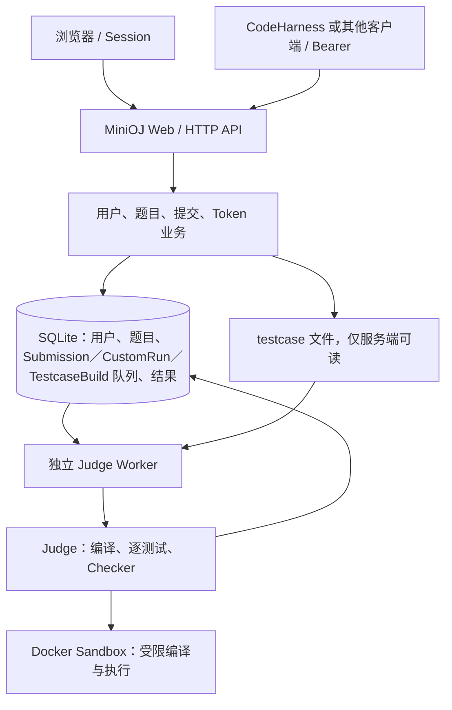

# MiniOJ 架构与接口约定

更新日期：2026-10-01。依据：用户提供的《MiniOJ：独立 OJ 项目规划与 Codex 执行提示词》、当前仓库实现及 Phase 0–3 复验证据。实施任务见 [TODO.md](../TODO.md)。

本文区分**规划约束／共用约定**、**当前实现**和**待明确事项**。已有代码不等于已经运行验证；Phase 0–3 的实际结果单列在第 12 节，不能外推为后续阶段或正式部署通过。Phase 2–3 从已推送的 `dbeb9e6` 开始实施；此前工作区改动均保留在该提交中。

## 1. 定位与 V1 边界

MiniOJ 是部署在 Ubuntu / WSL Ubuntu 的独立轻量级 Online Judge，既服务浏览器用户，也提供远程 HTTP JSON API。即使没有 CodeHarness，用户也能注册登录、看题、运行样例、自定义测试、提交 C++20、查看结果和管理 Token。

| 项目 | 环境 | 职责和边界 |
| --- | --- | --- |
| MiniOJ | Ubuntu / WSL Ubuntu | Web、用户权限、题目、testcase、提交、独立 Worker、Judge、Docker Sandbox、HTTP API |
| CodeHarness | macOS | 独立远程客户端；经 HTTP、Bearer Token 和 JSON 调用 MiniOJ |

仓库和产品名称只有 MiniOJ，不使用“CodeHarness OJ”。CodeHarness 的 Agent Loop、模型路由、LLM Provider、Prompt、Agent State、Workspace 和实验执行不属于本仓库；MiniOJ 不需要百炼或其他 LLM API Key。两个项目不相互 import，不共享数据库、题库目录和运行时对象。API 中 /agent/ 仅是程序消费命名空间，不意味着 MiniOJ 内部有 Agent。

V1 技术栈为 Python、FastAPI、SQLAlchemy、SQLite、Jinja2、markdown-it-py、mdit-py-plugins、少量 JavaScript、Docker、g++ C++20。题面数学公式由本地托管的 KaTeX 0.18.10 在浏览器渲染，不依赖外部 CDN。现有包要求 Python >=3.11，Conda 和 Web 镜像使用 Python 3.12；采用 Argon2 密码哈希、Pydantic 请求结构、签名 Session。依赖依据 [pyproject.toml](../pyproject.toml)、[environment.yml](../environment.yml) 和 [Dockerfile](../Dockerfile)。

V1 不引入 React、Vue、Redis、RabbitMQ、NATS、Kubernetes；不做多语言、Special Judge、交互题、Contest、排行榜、积分系统、Codeforces 自动导入或复杂编辑器。按新增需求，generated 现在可由 Admin 上传的 C++20 generator 实际生成；题目包导入、Brute／Stress Test、SSE、多 Worker 和外部队列仍留待未来单独规划。

## 2. 模块职责与现有目录

沿用现有 src/minioj 布局，不为匹配推荐目录而搬迁模块或创建空文件。

| 职责 | 当前文件 | 约束与差距 |
| --- | --- | --- |
| HTTP 入口与配置 | [server/main.py](../src/minioj/server/main.py)、[config.py](../src/minioj/config.py)、[middleware.py](../src/minioj/server/middleware.py) | 配置、Session、生命周期和请求限制；不在正式提交请求里判题 |
| Web 与 API | [web.py](../src/minioj/server/web.py)、[api.py](../src/minioj/server/api.py)、[dependencies.py](../src/minioj/server/dependencies.py) | 认证、权限、参数、响应和页面；当前仍包含大量业务和反馈拼装 |
| 业务、模型与数据库 | [accounts.py](../src/minioj/accounts.py)、[problems.py](../src/minioj/problems.py)、[testcase_builds.py](../src/minioj/testcase_builds.py)、[models.py](../src/minioj/models.py)、[database.py](../src/minioj/database.py) | 用户、题目、std／generator／Custom Run 队列、测试文件、提交和 Token |
| 反馈转换 | [feedback.py](../src/minioj/feedback.py) | Web 与 Agent Feedback 共用策略转换；长度限制和最终白名单仍属 Phase 5 |
| 协议结构 | [schemas.py](../src/minioj/schemas.py) | 目前主要有请求模型；还需响应、错误和反馈的明确 schema |
| Worker | [worker/main.py](../src/minioj/worker/main.py) | 独立进程轮询 Submission 与 TestcaseBuild，条件 claim 后调用 Sandbox 并保存结果 |
| Judge / 编译 / Sandbox | [judge/runner.py](../src/minioj/judge/runner.py) | 当前集中在 DockerJudge；逻辑上区分编译、逐测试运行、资源收集和结论生成，Docker 操作保持集中 |
| Checker | [judge/checker.py](../src/minioj/judge/checker.py) | 纯输出比较，不处理身份或页面 |
| 浏览器 | templates/、static/ | Jinja2、textarea、简单 JS 和本地 KaTeX 静态资源 |
| 运维与验证 | [CLI](../src/minioj/cli.py)、docker/cpp20/、deploy/、scripts/、tests/ | 初始化、管理员、镜像和测试；存在脚本不代表已通过验收 |

不创建 agent/ 或与 CodeHarness 共用内部实现的 shared/。外部客户端只见 HTTP，不接触 Docker、WSL 命令、数据库和 testcase 路径。

## 3. 部署关系与数据流

下图是正式提交的职责关系；Custom Run 的当前差异在下文说明。



**当前开发方式：** Web 与 Worker 可分别在 Ubuntu/WSL 运行，共用 `Settings` 及 `MINIOJ_*` 命名，并指向同一 SQLite 和 data。应用不会自行解析 .env；宿主进程须由 shell 或环境管理器注入，README 使用 `set -a; . ./.env; set +a`。minioj init-db 建表，Web/Worker 启动也调用初始化；minioj create-admin 或完整的启动管理员环境变量创建 Admin。

**当前 Compose 方式：** [compose.yaml](../compose.yaml) 只有 Nginx 和 Server，Worker 按 README 在 WSL 宿主启动。Compose 从 .env 读取插值，但只向 Server 注入文件内显式映射的配置；容器内数据库、data 和 job 路径为 /app/database、/app/data、/app/data/jobs，宿主挂载目录可用 `MINIOJ_DATABASE_DIR`／`MINIOJ_DATA_HOST_DIR` 覆盖。Worker 必须在宿主加载相应配置并使用同一份数据库和 testcase 数据；Docker bind mount 必须按 daemon 可见的宿主路径解析。Nginx 使用 /minioj/，保留该前缀以及原始 Host／非标准端口，Server 设置 MINIOJ_ROOT_PATH=/minioj。正式外部地址由部署者配置，不把仓库示例地址推广为其他环境默认值。

**Custom Run 部署链路：** 对外仍是同步 `POST /api/v1/runs`，Server 只写入短生命周期 `CustomRun` 行并等待 Worker 终态；独占 Worker 条件领取后调用 DockerJudge，完成后 Server 返回原有成功结果并删除该行。Server 镜像无需 Docker CLI 或 socket，也没有新增公共轮询接口。等待 Worker 超时会取消尚未领取的任务并返回安全 503；已领取任务由 Worker 收尾，终态遗留行按保留期清理。

**正式提交流程：**

1. Web/API 校验用户、语言、源码大小和题目，写入 QUEUED，返回 HTTP 202 与 submission_id。
2. Worker 选择最早 QUEUED 行，通过带 status=QUEUED 条件的 UPDATE 改为 COMPILING；仅 rowcount=1 的消费者持有该任务。
3. Worker 读取题目限制及 testcase；Judge 在独立容器内编译，失败保存 CE 并直接 FINISHED。
4. 编译成功调用回调将状态置 RUNNING；每个 testcase 新建执行容器，Checker 比较输出。
5. 当前遇首个失败即停止；保存 compile_result、judge_result、verdict、finished_at，并置 FINISHED；客户端查询最终结果。

V1 以数据库 Submission 为队列，不依赖外部消息系统。每个 `MINIOJ_JOB_DIR` 只允许一个 Worker：进程使用非阻塞文件锁防止本机重复启动，数据库条件 UPDATE 防止同一 QUEUED 行重复领取。Worker 启动时把遗留 COMPILING/RUNNING Submission 终结为安全 IE，把 RUNNING TestcaseBuild 终结为 FAILED；不自动重跑，避免不可信代码重复执行。最终结果也以非终态条件 UPDATE 写入，已终态任务不会被重复覆盖。此策略是单机 V1 恢复语义，不表示支持多主机 Worker。

Worker 启动恢复发生在镜像检查前；之后按 `minioj.owner=$MINIOJ_WORKER_OWNER` 标签清理上一进程的容器，并清理 run／judge／testcase-build 临时目录。owner 默认 `worker`，并行隔离实例必须使用不同值，避免跨实例清理。恢复时 RUNNING CustomRun 变为 FAILED，COMPILING/RUNNING Submission 变为 IE，RUNNING TestcaseBuild 变为 FAILED，均不自动重跑。正常清理失败会记录日志并按基础设施错误处理。claim、读取题目和最终落库的异常由循环记录；若处理阶段异常导致任务仍为非终态，独占 Worker 会尝试执行同一终结策略。内部 Docker、文件路径和 traceback 只写服务端日志，对外 IE 使用固定安全说明。

**Testcase 构建流程：** Admin 先为题目上传一份 C++20 std，源码和 SHA-256 只保存在管理侧数据库。上传输入时，Web 把 UTF-8 input 与 std 快照写入 TestcaseBuild；上传 generator 时还保存 generator 源码、case count 与 base seed。Worker 条件领取 QUEUED 任务，在同一受限 Docker 镜像中编译 std；generator 模式再编译一次 generator，并以 `argv[1]=base_seed+offset`、`argv[2]=1-based index` 逐例运行。generator stdout 成为输入，std stdout 成为 expected output。全部运行成功后，一批 Testcase 文件、metadata 和任务 FINISHED 状态在同一数据库提交边界完成；失败标记 FAILED 且不创建部分用例。Web Server 不需要 Docker 通道，共用用户／Agent HTTP 约定没有变化。Worker 异常退出后，遗留 RUNNING 构建在下次启动时置为 FAILED，不自动重跑。

**Custom Run：** 只编译源码并运行调用方 stdin，不查 hidden testcase、不创建正式 Submission，仍使用相同 Sandbox 和限制。Run Sample 从下拉框选择公开样例、把公开 input 交给 Custom Run 并在浏览器比较公开 expected；Custom Test 使用独立输入框，Submit 才创建正式评测。三个操作已有独立按钮。

## 4. 用户、Session、Token 与权限

User 角色为 user/admin。浏览器使用 Session；程序客户端日常使用 Authorization: Bearer <token>，初始 Token 从 Web Settings 创建。当前普通认证依赖优先处理 Authorization，缺失时读取 Session；/agent/ 两个接口强制 Bearer。普通题目 GET 当前公开可读。Session 表单和 Cookie API 写请求分别检查表单 CSRF 和 X-CSRF-Token；Bearer 请求走独立认证分支。

普通用户可看题、运行、提交、看本人提交和管理本人 Token。Admin 可 CRUD 题目、上传 std／generator、排队构建 testcase、查看全部提交、管理用户角色和启停。std、generator 源码和构建诊断不进入公开／Agent 题目响应。服务端检查权限；普通用户修改 URL 不能查看他人提交，当前提交和 Token 越权请求返回 404。

密码使用 Argon2，数据库不存明文。当前账号校验及账号 POST 请求体限制已有实现；这不代表源码、stdin 或上传已具备解析前的统一限制。Session 由 Starlette SessionMiddleware 签名，属于客户端 Cookie 会话，不能当作加密保密存储。

Token 当前以 oj_ 开头，随机生成，存 SHA-256 hash 和不可恢复完整密钥的掩码 preview；原文仅创建时显示。规划中的 minioj_ 是前缀示例，本轮不改现有前缀。支持 expires_at、revoked_at 检查和 last_used_at 更新。

当前 Web 通过 Session 中的 revealed_token 中转一次展示原文，需纳入 Cookie 暴露／缓存和一次展示验证；数据库不存 Token 原文。DELETE API 和 Web Delete **硬删除** Token，立即失效；尚未实现保留 metadata 的撤销操作。共用约定用“撤销”，具体保留语义列为 D10，不把两者混为已对齐。普通日志不得记录密码、Token 原文或 SECRET_KEY。

## 5. 数据模型与存储

字段依据 [models.py](../src/minioj/models.py)。表内“差距”是后续任务，不代表本轮已迁移数据库。

| 实体 | 当前主要字段 | 规划映射／差距 |
| --- | --- | --- |
| User | id, username, email, password_hash, role, is_active, created_at, updated_at | 当前工作区有 lower(username) 唯一索引；升级冲突直接报错，不自动合并账号 |
| ApiToken | id, user_id, name, token_hash, token_preview, created_at, last_used_at, expires_at, revoked_at | preview 为现有扩展；删除／撤销语义待对齐 |
| Problem | id, revision, deleted_at, title, statement, limits, source metadata, rating, tags, standard_source, standard_sha256, standard_updated_at, created_by, timestamps | std 仅 Admin 使用；有提交仍可编辑，revision 递增；deleted_at 标记软删除 |
| TestCase | id, problem_id, type, order, input_path, output_path, input_sha256, output_sha256, created_at | order 对应规划 index，每题唯一；旧库升级时补 created_at，旧文件的 checksum 可暂为空 |
| Sample | id, problem_id, testcase_id, input, output, order | 当前额外表，保存公开样例；新数据以可空且唯一的 testcase_id 精确同步，兼容没有关联的旧 Sample |
| TestcaseBuild | id, problem_id, created_by, kind, testcase_type, std 快照、input／generator、case_count、base_seed、status、error、created_count、timestamps | Admin-only 数据库队列；QUEUED → RUNNING → FINISHED/FAILED；中断后安全 FAILED，不自动重跑 |
| Submission | id, user_id, problem_id, problem_revision, language, source_code, status, verdict, created_at, started_at, finished_at, compile_result, judge_result | 记录提交时题目 revision，差异产生页面 warning；旧成绩不自动重判，结果为内部 JSON |
| CustomRun | id, user_id, language, source_code, stdin, status, result, error, timestamps | 短生命周期内部队列；QUEUED → RUNNING → FINISHED/FAILED，等待超时可 CANCELLED；不是正式 Submission |

关系为 User → Token／Submission／CustomRun、Problem → TestCase／Sample／Submission／TestcaseBuild，Problem.created_by 指向 User，Sample.testcase_id 可空地指向 TestCase。SQLite 开启外键。按用户新增要求，有提交仍可编辑题面、限制、std 和全部 Testcase。修改事务同时增加 revision，旧提交按 revision 差异提示“题目已修改”；旧库题目／提交共同以 revision=1 为升级基线，不追溯推断升级前的修改，也不保存完整历史题面快照。

整题删除为软删除：设置 deleted_at，保留题目行、文件、Submission 及其结果，题号不能复用；列表过滤，Web 旧链接显示删除说明（410），公共／Agent 题目 API 与新提交入口按不可用题目返回 404，管理写入口也拒绝。历史提交详情／列表优先显示删除警告，权限不变。公共 JSON schema 和共用 HTTP 约定没有增加字段，warning 由浏览器展示。

提交创建和 Worker 读取使用同一题目写锁与管理事务串行化；Worker 在锁内一次读取限制和全部 testcase，释放锁后才运行 Docker。版本已变化但尚未读取数据的提交结束为 IE 并说明重新提交；已读取数据的评测继续，旧成绩保持不变。删除在同一事务内将 QUEUED 提交结束为 IE，并将 QUEUED/RUNNING 构建任务置 FAILED。构建任务在执行前及落库前检查 deleted_at 和 std SHA-256，避免旧 std 结果写回，同时允许多个使用同一 std 的排队任务依次追加测试数据。软删除保留占用空间；物理清理和恢复入口不在本轮范围。

文件布局为：

```text
database/oj.db
data/problems/<problem-id>/tests/
  001-<uuid>.in
  001-<uuid>.out
  002-<uuid>.in
  002-<uuid>.out
${MINIOJ_JOB_DIR:-data/jobs}/<临时任务目录>/
```

数据库保存 testcase 的相对路径、SHA-256 和 metadata，样例可公开；hidden 和 generated 不作为静态文件挂载。主要 Web 范式只上传 std 与输入，或 std 与 generator，输出由 Worker 自动计算；旧的 Admin JSON／直写路由为兼容保留，不属于共用 HTTP 约定。上传只接受 UTF-8，单个输入或输出默认最多 16 MiB，std／generator 使用源码上限。存储始终计算实际 SHA-256，使用唯一文件名、临时文件、fsync 和原子替换。

读取必须落在当前题目的 tests 目录内，拒绝路径穿越、跨题目引用、题目目录或目标文件符号链接，并核对已记录的 checksum。新增失败会删除新文件；更新先提交指向新文件的 metadata，再清理旧文件；整题软删除不移动或删除文件，数据库失败整体回滚。单个 testcase 删除／更新后的文件清理失败宁可留下无 metadata 引用的孤立文件，也不留下损坏引用。上述路径、符号链接和数据库 commit 失败分支已有自动化回归。Worker 会把全部 testcase 内容读入内存，不属于大数据流式处理。

当前独立配置名为 `MINIOJ_JOB_DIR`；未设置时回退到 `MINIOJ_DATA_DIR/jobs`，保持现有安装兼容。宿主 Worker 推荐可设置为 `/tmp/minioj/jobs`，使临时编译／运行文件不进入 testcase 备份；测试和栈冒烟显式使用各自临时 job 目录。job 路径必须对 Docker daemon 可见。用户程序容器只挂载当前 job，不挂载 testcase 根目录；输入通过 stdin 提供，expected 由 Judge 在容器外比较。

## 6. 状态、结果与 Sandbox

### 6.1 状态机与 verdict

```text
QUEUED → COMPILING → RUNNING → FINISHED
            └─ CE / IE ──────────↑
                        IE 可从异常路径进入终态
```

status 表示流程，verdict 表示最终结论：

| Verdict | 含义 |
| --- | --- |
| AC | Accepted |
| WA | Wrong Answer |
| CE | Compilation Error |
| RE | Runtime Error |
| TLE | Time Limit Exceeded |
| MLE | Memory Limit Exceeded |
| OLE | Output Limit Exceeded |
| IE | Internal Error |

内部 Judge、Worker、模型默认值和 API 流程共用 `SubmissionStatus`／`Verdict` 字符串枚举，并在最终写入前校验：非终态不得携带 verdict 或最终结果，FINISHED 必须有与 judge_result 一致的 verdict；非 IE 正式结果必须有 compile_result。Custom Run 的 OK 仍只是运行成功状态，不等于正式 AC。共用 HTTP 的完整可空字段规则仍需在 Phase 4–5 冻结，本轮未增加或改名路由和响应字段。

Docker／Sandbox 创建失败、testcase 缺失损坏、Judge 内部异常属于 IE，不属于用户程序 RE。持久化 summary 只使用基础设施不可用、Judge 数据不可用、内部错误、中断以及题目修改／删除等安全类别；内部路径、Docker 诊断和 traceback 只进入服务端日志。Custom Run 的 503 也不再回显 Docker 原因。

### 6.2 编译、执行与比较

编译和执行都在 Docker 内，不能在宿主直接运行用户程序。当前 g++ 参数为 -std=c++20 -O2 -pipe，编译挂载可写 job，执行时只读挂载；每个 testcase 独立容器。

内部 ProcessResult 包含 exit_code、stdout、stderr、time_ms、可空 memory_kb、timed_out、output_exceeded、oom_killed、stdout_truncated、stderr_truncated。compile_result 保存上述字段、success 和 stdout/stderr 合并含义的 output_truncated。judge_result 的 `test_results` 为每个**已执行**用例保存 index、verdict、exit code、时间、可空内存峰值及超时／OOM／输出超限／截断标志；遇首个失败仍停止。完整 input、expected、actual、stderr 只保留在现有首个 failure 结构中，后续由 Feedback Policy 控制暴露。

Checker 将 CRLF/CR 转为换行，去掉每行末尾空格／Tab 和输出末尾空行，保留行内与行首差异；不做 Special Judge、交互或多答案判断。

下列数字仅记录 [runner.py](../src/minioj/judge/runner.py) 的当前实现，**不是本轮确认的资源契约**：

| 项目 | 当前实现记录 |
| --- | --- |
| 编译 | MINIOJ_COMPILE_TIME_LIMIT_MS，默认 30000 ms；内存 max(题目限制, MINIOJ_COMPILE_MEMORY_MB)，后者默认 512 MiB |
| 运行 | 容器内 timeout 按题目时间限制；宿主兜底额外 3000 ms |
| Custom Run | 函数默认 3000 ms、256 MiB |
| 隔离 | 禁网、CPU 1.0、PID 64、用户 1000:1000、drop ALL capabilities、no-new-privileges、只读根目录 |
| 临时空间 | /tmp 为 16 MiB tmpfs；仅当前 job 挂载到 /work |
| 输出 | stdout + stderr 共享配置上限；轮询大小、超限停止，返回截断标记 |
| 时间统计 | 当前 time_ms 包含 Docker start/attach 等宿主墙钟开销 |
| 内存统计 | 从两类宿主 cgroup v2 memory.peak 路径读取，除以 1024；采集不到时为 null，不伪造 0 |
| 多测试汇总 | 已执行 testcase 的 time_ms 和 memory_kb 各取最大值；首个失败后停止 |

时间取宿主墙钟毫秒，包含 Docker start/attach 开销；多用例资源取已执行用例最大值。运行使用 GNU timeout 的 preserve-status：快速主动返回 124/137 是 RE，达到期限后的 137/143 才映射 TLE，OOMKilled 优先为 MLE。短程序退出后的 stdout+stderr 仍做合并限额复查，真实 Docker 已覆盖有限大输出和编译诊断超限。当前输出先落宿主临时文件并高频监测，仍不是文件系统级硬配额；当前队列容量和过载策略见已落实的 D3／D6。

容器不得访问 Docker socket、宿主 home、MiniOJ 数据库、.env、其他题目和 Submission。正常及异常都应清理；配置存在不等于隔离已验证，受控测试见 TODO。

## 7. 浏览器页面

题面、输入说明、输出说明和备注先由禁用原始 HTML 的 CommonMark 渲染；`mdit-py-plugins` 在该阶段识别并保护 `$...$` 与独立成行的 `$$...$$`，避免 TeX 反斜杠、下标等被 Markdown 改写。题目详情和 Admin 预览随后使用同一份本地 KaTeX 资源渲染公式，设置 `trust=false` 并限制宏展开和尺寸。编辑预览在替换 HTML 后显式重新渲染新增公式；CommonMark 的原始 HTML 禁用和危险链接过滤约束保持不变。

| 路径 | 规划用途 | 当前情况 |
| --- | --- | --- |
| / | 首页 | 已有页面 |
| /register、/login、/logout | 注册／登录／退出 | GET 页面，POST 会话操作；退出为 POST |
| /problems | ID、题名、来源、Rating、Tags | 已有列表 |
| /problems/{problem_id} | 题面、限制、说明、样例、备注、C++20、Run Sample／Custom Test／Submit | 三个独立操作已实现；样例选择及 expected 比较在浏览器完成 |
| /submissions | 本人提交，Admin 可看全部 | 已有权限过滤 |
| /submissions/{submission_id} | 源码、状态、verdict、编译日志、测试摘要、资源 | 非终态自动查询并在终态刷新；展示使用统一 Feedback Policy 转换 |
| /settings | 资料、密码、Token | 已有创建／一次展示／metadata／删除 |
| /admin | 题目、std、generator、testcase、构建任务、提交、用户管理 | std／输入／generator 由宿主 Worker 异步构建；有提交也可编辑／软删除，旧提交展示修改／删除警告 |

全局 `static/alerts.js` 为 `.alert-warning` 添加可通过鼠标或键盘操作的 × 关闭按钮；关闭仅移除当前页面中的提示，刷新后恢复，不持久化忽略状态，也不改变题目版本或历史记录。Admin 编辑页分为题面／限制、std、测试数据、构建历史四个编号分区，提供锚点导航；std 直接回显源码，输入文件与 generator 构建分开呈现。

既有 Admin Web 路由 `POST /admin/problems/{problem_id}/standard-solution` 接受粘贴字段 `standard_source` 或上传字段 `standard_file`，不可同时提供两者。两种方式均沿用 Admin／CSRF 校验、UTF-8、非空和源码字节上限检查，并保存源码及 SHA-256；校验失败以 422 重新渲染编辑页并保留粘贴草稿。源码仅在管理员编辑页展示并按 HTML 转义。本次不新增配置或数据库字段，不修改双方共用 HTTP 约定。

所有出口须遵守服务端信息暴露策略，不能仅在专用 Feedback API 隐藏数据。Web 提交详情与 Agent Feedback 已共用服务端策略转换，非法模式在 Server 启动时拒绝；普通提交查询只返回测试摘要和资源。内容长度限制、生效模式告知及最终字段白名单仍由 Phase 5 完成。

## 双方共用的 HTTP 接口约定

本节在 MiniOJ 和 CodeHarness 两份规划中保持一致。它是现有方案的接口约定，不表示这些接口已经实现或经过联调。

MiniOJ 是服务端；CodeHarness 是远程客户端。两个项目分别开发和部署，不相互 import 内部模块，不共享数据库、题库目录或运行时对象。联调通过 HTTP、Bearer Token 和 JSON 完成。

### 认证与命名

- 浏览器使用 MiniOJ Session；程序客户端使用 `Authorization: Bearer <token>`。
- CodeHarness 从 `OJ_BASE_URL` 和 `OJ_API_TOKEN` 读取连接配置。
- API 前缀保留 `/api/v1/`。`/agent/` 只是面向程序消费的接口命名空间，不表示 MiniOJ 内部实现了 Agent。
- 不因两个项目重新命名而擅自修改已约定的 API 路径。

### 接口清单

| 方法   | 路径                                                 | 用途                         |
| ------ | ---------------------------------------------------- | ---------------------------- |
| GET    | `/api/v1/me`                                         | 检查身份与连接配置           |
| GET    | `/api/v1/problems`                                   | 查询普通题目列表             |
| GET    | `/api/v1/problems/{problem_id}`                      | 获取普通题目详情             |
| GET    | `/api/v1/agent/problems/{problem_id}`                | 获取清洗后的程序用题目       |
| POST   | `/api/v1/runs`                                       | 使用调用方提供的输入执行代码 |
| POST   | `/api/v1/submissions`                                | 创建正式评测提交             |
| GET    | `/api/v1/submissions/{submission_id}`                | 查询提交状态和结果           |
| GET    | `/api/v1/agent/submissions/{submission_id}/feedback` | 获取结构化评测反馈           |
| GET    | `/api/v1/tokens`                                     | 查看本人 Token metadata      |
| POST   | `/api/v1/tokens`                                     | 创建本人 Token               |
| DELETE | `/api/v1/tokens/{token_id}`                          | 撤销本人 Token               |

CodeHarness 日常求解不必使用 Token 管理接口。初始 Token 由用户登录 MiniOJ Web 页面后创建。

### 程序用题目响应

```json
{
  "problem_id": "example-problem",
  "title": "Example Problem",
  "statement": "...",
  "input_specification": "...",
  "output_specification": "...",
  "notes": "...",
  "limits": {
    "time_ms": 2000,
    "memory_mb": 256
  },
  "samples": [
    {"input": "...", "output": "..."}
  ]
}
```

默认不包含 `rating`、`tags`、`editorial`、历史解法或 hidden testcase。CodeHarness 的求解上下文使用这个接口，不以普通题目接口补回被排除的信息。

### 正式提交

请求：

```json
{
  "problem_id": "example-problem",
  "language": "cpp20",
  "source_code": "..."
}
```

提交成功返回 `HTTP 202 Accepted`：

```json
{
  "submission_id": 1,
  "status": "QUEUED"
}
```

提交状态统一为：

```text
QUEUED → COMPILING → RUNNING → FINISHED
```

编译失败等情况可以提前进入 `FINISHED`，不要求每次经过全部中间状态。

最终 verdict 统一为：

```text
AC / WA / CE / RE / TLE / MLE / OLE / IE
```

客户端根据机器字段判断状态，不解析 `summary` 文本来推断 verdict。尚未完成的提交不应被当作最终评测结果；具体的未完成反馈响应形式需要在正式联调前确定。

### Custom Run

请求：

```json
{
  "language": "cpp20",
  "source_code": "...",
  "stdin": "..."
}
```

成功执行后的结果示例：

```json
{
  "status": "OK",
  "stdout": "...",
  "stderr": "",
  "exit_code": 0,
  "time_ms": 15,
  "memory_kb": 4096,
  "stdout_truncated": false,
  "stderr_truncated": false
}
```

Custom Run 不运行 hidden testcase，也不创建正式 Submission。编译、执行仍由 MiniOJ Sandbox 完成。对外保留同步响应：内部排入 Worker 队列，成功返回上述结果；队列满为 429 + `Retry-After`，等待 Worker 超时或基础设施故障为安全 503。旧请求字段 `code` 继续兼容；以 `source_code` 为准，两者同时给出且不同则 422。不添加新的轮询接口。各失败状态的最终公开 schema 仍留给 Phase 4。

### 结构化反馈

CE 示例：

```json
{
  "verdict": "CE",
  "summary": "Compilation failed.",
  "compile": {
    "success": false,
    "stderr": "..."
  }
}
```

WA 的完整反馈示例，仅适用于服务端允许暴露这些字段的模式：

```json
{
  "verdict": "WA",
  "summary": "Wrong answer on test 13.",
  "failure": {
    "test_index": 13,
    "input": "...",
    "expected": "...",
    "actual": "..."
  },
  "resources": {
    "time_ms": 17,
    "memory_kb": 4200
  }
}
```

TLE 示例：

```json
{
  "verdict": "TLE",
  "summary": "Time limit exceeded on test 21.",
  "failure": {"test_index": 21},
  "limits": {"time_ms": 2000}
}
```

还需为 AC、RE、MLE、OLE、IE 定义明确结构。编译诊断可以用于调试，但 Docker 内部日志、宿主文件路径和 Worker traceback 不属于对外协议。

### Feedback Mode

| 模式           | 已约定的用途与暴露范围                                       |
| -------------- | ------------------------------------------------------------ |
| `full`         | 开发调试；允许返回失败用例的 input、expected、actual、stderr、编译诊断，可能包含 hidden testcase |
| `diagnostic`   | 返回诊断信息，但不提供完整 hidden testcase；具体字段白名单待明确 |
| `verdict_only` | benchmark；返回 verdict 和受限说明，可保留约定的失败测试序号，不返回 hidden testcase 内容 |

V1 默认模式是 `full`。模式和访问权限由 MiniOJ 服务端控制，CodeHarness 不能自行提高反馈权限。普通 API、专用 Feedback API 和 Web 页面均应遵守服务端的信息暴露规则。

`full` 条件下可见失败 hidden testcase，不能将它与 `verdict_only` 条件下的结果混为同一实验条件。

### 联调前仍需确定

- 普通提交查询接口的完整 schema，以及字段在未完成状态下是省略还是为 null。
- AC、RE、MLE、OLE、IE 和通用 HTTP 错误的完整 schema。
- Custom Run 各失败状态的最终公开 schema 和具体资源限制（同步 Worker 队列交付已确定）。
- Feedback Mode 的诊断字段白名单，以及客户端如何获知实际生效的模式。
- 请求超时、轮询间隔和轮询总期限；提交请求超时后的去重或查重办法。
- 多 testcase 的耗时、内存汇总口径和单位含义。

这些事项记录为待确定，不填写未经确认的默认值，不把草案标成已冻结协议。

## 8. 共用约定与当前代码差异

上面的“双方共用的 HTTP 接口约定”按用户提供文本保留；其 JSON 示例、字段和路径不因现有实现不同而改写。下面仅描述已阅读代码，不宣称协议已冻结或联调通过。

| 接口／行为 | 当前代码 | 对齐工作 |
| --- | --- | --- |
| GET /api/v1/me | Session 或 Bearer；id、username、email、role、is_active、created_at | 固定响应模型 |
| 普通题目 GET | 列表为数组；详情含 source/source_id/source_url/rating/tags，公开读取 | 完整 schema 和访问规则记录 |
| 程序用题目 GET | 强制 Bearer，返回共用示例中的题面字段、limits、samples | 保持白名单，补排除字段回归 |
| POST /api/v1/submissions | problem_id/language/source_code；202 + submission_id/status | 现有基本形态一致；去重、请求限制与完整错误仍待定 |
| GET /api/v1/submissions/{submission_id} | submission_id、problem_id、language、status、verdict、tests、resources、三个时间字段 | 尚无显式 response model；未完成 verdict/tests/resources/时间可能 null，完整规则待确认 |
| POST /api/v1/runs | source_code/language/stdin；兼容相同值的旧 code；Server 排队并同步等待 Worker | 成功形态保持；不增加轮询路由，完整错误响应模型仍待 Phase 4 |
| Custom Run 结果 | 状态 OK/CE/TLE/OLE/MLE/RE；队列满 429 + Retry-After，等待超时／基础设施故障 503 | IE 已脱敏；统一错误 schema 待补 |
| GET/POST /api/v1/tokens | 当前 metadata 含 preview，创建返回一次性 token，输入含 expires_in_days | 明确 schema、空名称等校验和到期语义 |
| DELETE /api/v1/tokens/{token_id} | 硬删除并返回 204 | 共用用途为撤销，metadata 是否保留待 D10 |
| 非终态 Feedback | 当前 HTTP 200，status、verdict=null、summary 为进行中说明 | 作为现状记录；是否沿用需联调前确认 |
| 最终 Feedback | Web 与 Agent 共用策略转换；CE／异常旧编译失败记录附 compile，再按模式过滤 | 明确 response schema、长度限制和最终白名单仍待 Phase 5 |
| HTTP 错误 | HTTPException detail 有字符串或对象，422 校验错误也有自身结构 | 统一错误格式未完成 |

现有还提供 POST /api/v1/auth/register，以及 /api/v1/admin/problems 下的管理员题目／testcase 接口；Testcase 支持 POST、PUT 和 DELETE，响应含 order、类型、SHA-256 与 created_at。这些是管理员扩展，不更改共用接口清单或其 HTTP 约定。程序日常认证不使用账号密码。

当前最终结果的内部形态：AC 含 verdict/summary/tests/resources；WA/RE/TLE/MLE/OLE 增加 failure/limits/截断字段；CE 有 compile；IE 可能有 tests/resources。完整公开字段、可空性和错误类别仍需 D1、D2 确认，不能从内部 dict 推导为已冻结协议。

## 9. Feedback Mode 的服务端边界

V1 默认 full。实际模式由 MiniOJ 配置及权限决定，客户端不能通过请求参数提升。full 允许失败 hidden testcase 内容不代表题目接口可以公开整个 hidden 测试集，也不取消提交所有权检查。

| 模式 | 目标约束 | 当前差距 |
| --- | --- | --- |
| full | 可返回获准的失败 input/expected/actual/stderr/编译诊断，可能包含 hidden；仍需长度限制和内部信息脱敏 | Web 与 Agent 共用转换并返回完整失败内容；尚无独立反馈截断 |
| diagnostic | 提供诊断但不返回完整 hidden；字段白名单待确认 | Web 与 Agent 都把 failure 缩为 test_index、编译结果缩为 metadata；其他字段仍保留，最终白名单待确认 |
| verdict_only | verdict 和受限说明，可保留约定的失败序号，不返回 hidden 内容 | Web 与 Agent 当前都只返回 verdict/summary；生效模式告知仍待明确 |

MINIOJ_FEEDBACK_POLICY 在 Server 启动时校验 `full|diagnostic|verdict_only`，错误值会拒绝启动，不会意外回退到 full。普通提交 API 只选择 tests/resources 等摘要字段；Web 提交详情和专用 Feedback API 共用同一转换。后续仍须确定模式告知、角色关系、内容截断和最终 diagnostic 白名单。

对外 summary 只做说明，机器依赖 status/verdict；不得依赖 Docker exit code、signal 或 traceback 在 Web/客户端重新推断判题。full 与 verdict_only 的结果必须记录为不同反馈条件；生效模式如何告知客户端待确认。

## 10. 配置、日志与运维

读取依据 [config.py](../src/minioj/config.py) 和 [.env.example](../.env.example)。当前代码只读取进程环境，不自行加载 .env。宿主命令须在每个终端显式导入 .env；Compose 自动读取它做插值，但只有 [compose.yaml](../compose.yaml) 映射的键会进入 Server。README 已分别说明两条路径，不能把“文件存在”当作进程已加载。

| 规划概念 | 当前配置／实现 | 约束／剩余工作 |
| --- | --- | --- |
| DATABASE_URL | MINIOJ_DATABASE_URL | 保持命名兼容；宿主 Web/Worker 必须指向同一 SQLite，Compose 使用固定挂载路径 |
| SECRET_KEY | MINIOJ_SECRET_KEY | Server 导入时拒绝缺失、少于 32 字符及已知占位值；错误不回显输入值 |
| DATA_DIR | MINIOJ_DATA_DIR | testcase 与 metadata 一致性备份 |
| JOB_DIR | MINIOJ_JOB_DIR；缺省回退 MINIOJ_DATA_DIR/jobs | 可独立放在 `/tmp/minioj/jobs`；路径须对 Docker daemon 可见 |
| MAX_TESTCASE_FILE_SIZE | MINIOJ_TESTCASE_FILE_LIMIT_BYTES；默认 16777216 | 单个输入或输出文件；上传解析和文本／JSON 存储共用此限制 |
| TESTCASE_BUILD_LIMITS | MINIOJ_TESTCASE_BUILD_TIME_LIMIT_MS=10000、MINIOJ_TESTCASE_BUILD_MEMORY_MB=512 | std 与 generator 每次执行的时间／内存限制；最终资源策略仍见 D6 |
| GENERATOR_MAX_CASES | MINIOJ_GENERATOR_MAX_CASES；默认 50 | 单个 generator 任务的批量上限；seed 范围 0–2147483647 |
| DOCKER_IMAGE_CPP20 | MINIOJ_DOCKER_IMAGE | 沿用已有镜像设置，不无故重命名 |
| WORKER_OWNER | MINIOJ_WORKER_OWNER；默认 worker | Docker 清理标签；并行隔离实例必须唯一 |
| FEEDBACK_MODE | MINIOJ_FEEDBACK_POLICY，当前默认 full | 枚举校验与所有出口一致执行 |
| MAX_SOURCE_SIZE | MINIOJ_SOURCE_LIMIT_BYTES；示例为 262144 | 最终资源契约仍见 D6 |
| MAX_RUN_INPUT_SIZE | MINIOJ_STDIN_LIMIT_BYTES；示例为 262144 | 最终资源契约仍见 D6 |
| MAX_OUTPUT_SIZE | MINIOJ_OUTPUT_LIMIT_BYTES；示例为 1048576 | 当前 stdout/stderr 合并计数；最终截断语义仍见 D6 |
| COMPILE_LIMITS | MINIOJ_COMPILE_TIME_LIMIT_MS=30000、MINIOJ_COMPILE_MEMORY_MB=512 | 编译内存与题目内存上限取较高值；正整数配置校验 |
| 队列与等待 | MINIOJ_MAX_QUEUED_SUBMISSIONS=1000、MINIOJ_MAX_QUEUED_RUNS=16、MINIOJ_CUSTOM_RUN_WAIT_SECONDS=45、MINIOJ_OVERLOAD_RETRY_AFTER_SECONDS=2 | 单 Server 进程内锁住计数与入队；SQLite／单进程是 V1 扩展边界 |
| 部署与 Session | MINIOJ_ROOT_PATH、MINIOJ_HTTP_BIND／PORT、MINIOJ_DATABASE_DIR、MINIOJ_DATA_HOST_DIR、MINIOJ_SESSION_HTTPS_ONLY | Compose 当前验证 `/minioj/`；正式地址和 HTTPS 由部署者配置 |
| Token 生命周期 | MINIOJ_TOKEN_DEFAULT_DAYS；API 创建请求另有 expires_in_days | 统一配置与契约解释 |
| 启动管理员 | MINIOJ_ADMIN_USERNAME、MINIOJ_ADMIN_EMAIL、MINIOJ_ADMIN_PASSWORD | 三项一起设置；不保存真实示例 Secret |

现有源码／输入上限各 262144 字节，输出 1048576 字节，Token 默认 90 天；.env.example、Compose 映射和 README 已与这些实现值同步。这些仍是可追溯的现状，不替代未来资源限制决策。真实 .env 已在 .gitignore 中且本轮确认未被跟踪，不增加模型供应商密钥。

日志覆盖 HTTP 错误、登录失败、提交创建、Worker claim、编译／评测开始结束、verdict、恢复及 Sandbox／Worker 异常；提交和构建路径携带各自关联标识。日志不记录源码、Token 或 Secret，对外 IE 类别与内部诊断分开保存和展示。跨服务统一 trace ID 和集中日志仍不在 V1 范围内。

SQLite 和 data/problems 需一致性备份并在独立目录恢复验收；清理策略需覆盖 job、容器和异常残留。现有 restart、Compose 和 Nginx 配置保留；systemd user Worker unit 已提供并通过静态校验，隔离 Compose 部署已实测。CI、备份恢复及正式环境部署仍是后续工作。

## 11. 决策状态

以下编号与 TODO 对应。在实施依赖它们的功能或正式联调前落实。D3、D6、D7、D8、D9、D11 已按对应阶段落实；D1、D2、D4、D5、D10 仍不得由当前内部字典或默认值推断为冻结协议。

| 编号 | 待明确事项 | 已有行为不代表最终决定 |
| --- | --- | --- |
| D1 | 提交查询完整 schema、未完成字段 null／省略、非终态反馈及 HTTP 状态 | 当前查询有 null，Feedback 为 200 |
| D2 | AC/RE/MLE/OLE/IE、通用 HTTP 错误完整 schema，CE/WA/TLE 示例的完整约束 | 已有 dict 和错误分支，但无完整公开模型 |
| D4 | diagnostic 白名单、模式／权限关系、生效模式告知、非法配置和截断策略 | Web／Agent 已共用转换且非法值拒绝；最终白名单、角色、告知和长度限制待 Phase 5 |
| D5 | 请求超时、轮询间隔／总期限、提交超时后去重或查重 | 未建立共用契约 |
| D3／D6（已落实） | Custom Run 交付／调度／兼容及容量过载；编译运行限制与统计语义 | 同步 HTTP + 内部 Worker 队列；source_code 与 code 兼容；提交／Run 独立容量，429 Retry-After，基础设施 503；资源值可配置 |
| D7（已落实） | 已 claim 任务中断后的恢复／终态及防重入、重复写入 | 单 Worker 独占；启动恢复到 IE／FAILED，不自动重跑；条件 claim 和条件终态写入防止重复覆盖 |
| D8（按新增需求修订） | 题目／testcase 编辑删除、历史版本与提交保留、样例同步、文件事务一致性 | 有提交仍可编辑和软删除；revision 驱动 warning，历史成绩保留，不自动重判；Sample 精确关联，文件与数据库失败路径采用前述一致性策略 |
| D9（当前部署已落实） | 根路径或反向代理子路径、外部 URL、数据和 daemon 路径关系 | Compose 使用已实测 `/minioj/`；宿主挂载／端口可覆盖，正式地址由部署者配置 |
| D10 | Token 撤销、硬删除及 metadata 保留；oj_ 前缀兼容 | DELETE 当前硬删除，revoked_at 只用于校验 |
| D11（已落实） | 编译／逐用例结果保存、上传和大 testcase 边界 | 上传、checksum、完整 compile_result 及已执行用例的受限 metadata 均已落实；首个 failure 数据继续受后续 Feedback Policy 约束 |

## 12. 实施与验证边界

Phase 0–5 的目标、依赖、可勾选任务、交付物和验收标准统一维护在 [TODO.md](../TODO.md)。Phase 0–3 已分别验收；这些证据不能外推为 Phase 4–5 或正式环境部署通过。

Phase 0 在 2026-10-01 使用 Conda `minioj` 环境（Python 3.12.14、Ruff 0.16.9、pytest 8.4.2）通过 `ruff format --check .`（42 个文件）、`ruff check .`、138 项 pytest、`docker compose config --quiet`、.env 忽略／未跟踪检查和 `git diff --check`。另在 /tmp 隔离目录连续两次执行 `minioj init-db`，再以回环 Uvicorn 确认首页、healthz 和静态 CSS 均为 HTTP 200；临时服务和目录已清理。升级测试覆盖旧 Token preview 保留、用户名大小写索引幂等和冲突拒绝，配置测试覆盖独立 Job 目录和 Secret 拒绝／脱敏。

Phase 1 及 std／generator 扩展此前通过 167 项 pytest，并通过真实 generator → std 的 2 组输入／输出冒烟。随后按新增要求调整为有提交后可编辑／软删除，并补充本地 KaTeX 数学公式支持；该次工作区通过 `ruff format --check .`（51 个文件）、`ruff check .`、178 项 pytest（80.79s）、`docker compose config --quiet` 和 `git diff --check`。新增回归覆盖新旧提交的 warning 区分、无变化保存、Web/API 编辑及删题、旧成绩与访问权限保留、软删除回滚、旧库版本字段幂等升级、排队提交失效、运行中修改／删题、generator 过期拒绝及连续追加，以及行内／块级 TeX 标记和本地 KaTeX 资源；`node --check` 与 KaTeX 显示公式／MathML 冒烟通过，该次未运行真实浏览器视觉验收。

本次编辑页改进后，当前工作区通过 `ruff format --check .`（51 个文件）、`ruff check .`、183 项 pytest（79.63s）、`node --check static/alerts.js`、`node --check static/problem_form.js` 和 `git diff --check`。新增回归覆盖 std 粘贴保存及回显、HTML 转义、普通用户不可读取、Admin／CSRF 校验，以及空白、超限、同时上传与粘贴时的拒绝和草稿保留。使用隔离数据库和回环 Uvicorn 的真实 Chromium 验证了鼠标／键盘关闭警告、刷新恢复、粘贴保存、文件上传回显、四个分区及桌面 1365px／手机 390px 无页面横向溢出；无页面脚本错误，临时服务已停止。本次未重跑真实 Docker 冒烟或正式部署，不将编辑页检查视为全部数学公式的视觉验收。

Phase 2 当前工作区使用相同 Conda 环境通过 `ruff format --check .`（55 个文件）、`ruff check .`、202 项 pytest（77.26s）、三个前端脚本 `node --check`、`docker compose config --quiet` 和 `git diff --check`。Docker Client／Server 29.8.1、镜像 `sha256:140820...2a95` 上，栈冒烟通过 Custom Run 和 API → Submission → Worker → Docker → Feedback，generator → std 两例复验通过；Judge 冒烟通过七种 verdict、主动退出 124/137、有限短输出、编译输出超限／截断且无 owner 容器或新增 job 目录残留；Sandbox 冒烟验证网络、PID、宿主文件、只读根目录和清理；Worker 故障冒烟验证损坏／缺失 Testcase、不可用镜像均为安全 IE，随后 healthz 为 200。自动化另覆盖中断恢复、独占锁、重复 claim／结果、内存缺失为 null 和清理失败。

Phase 3 新增数据库 CustomRun 队列、容量／Retry-After、`source_code` 兼容、独立 Run Sample／Custom Test／Submit、提交自动更新、统一 Web／Agent Feedback 转换、systemd user unit 和可隔离 Compose 挂载／端口。最终全量检查为 Ruff 57 个文件、217 项 pytest（93.85s）；自动化覆盖同步等待 Worker、429、503、恢复和策略一致性。Playwright Chromium 153.0.8010.12 在临时数据库、data、端口和独立 Compose project 中，经 Nginx + Server + 宿主 Worker 的 `/minioj/` 真实完成登录、网页 Token、Run Sample、Custom Test、Submit 和自动刷新到 AC；独立 Bearer 客户端完成 CE、TLE 和查询。删除临时镜像别名注入 Docker 故障后 Custom Run 返回安全 503，Web health 保持 200；无额外 Submission、owner 容器或 job 目录残留，Compose 与临时数据已清理。该证据是隔离部署，不是正式环境上线；本轮不进入 Phase 4。
